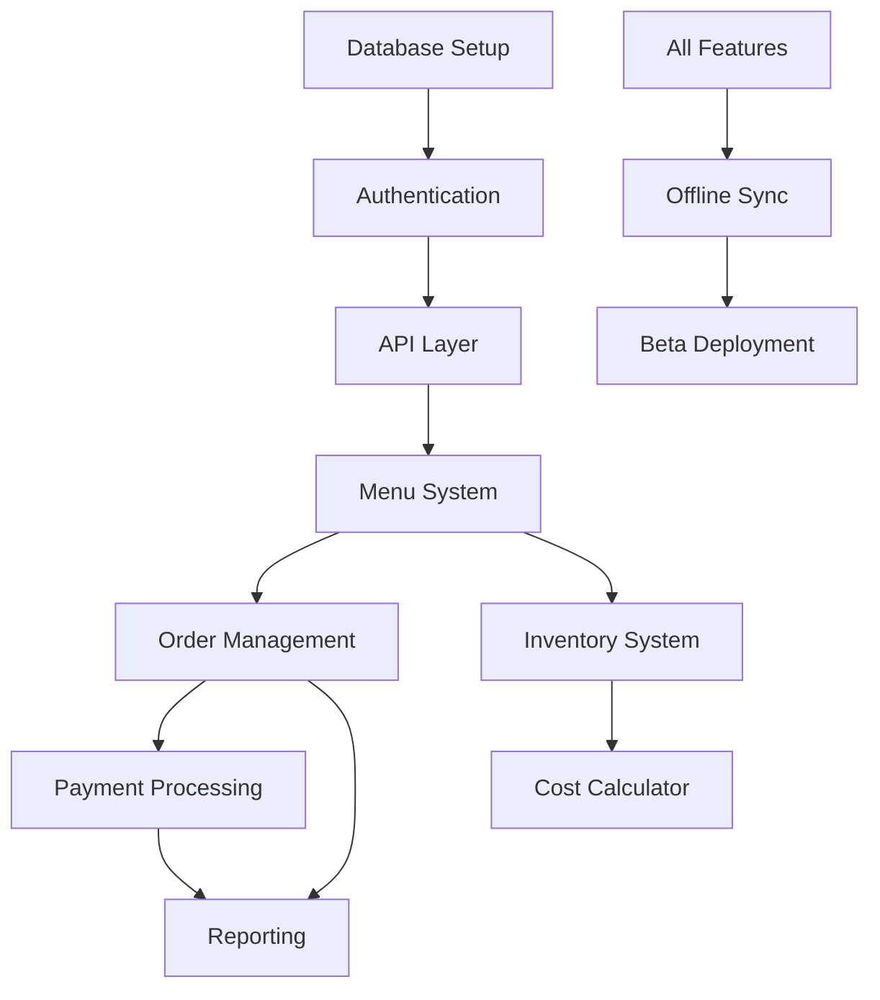

# HOST Technical Implementation Roadmap
## 12-Week MVP Development Schedule

---

## Technology Stack Overview

### Core Technologies
- **Frontend**: Svelte 5 + TypeScript + Tailwind CSS 4
- **Meta-Framework**: SvelteKit (latest)
- **Backend**: SvelteKit Server + tRPC (optional)
- **Database**: Turso (LibSQL) + Drizzle ORM
- **Authentication**: Keycloak 25.0 LTS
- **Payments**: Stripe Connect
- **Infrastructure**: Vercel Edge Functions + Cloudflare Workers
- **Testing**: Vitest + Playwright + Svelte Testing Library

---

## 📅 Week-by-Week Development Schedule

### 🏗️ Phase 1: Foundation (Weeks 1-3)

#### Week 1: Infrastructure Setup
**Monday-Tuesday**
- [ ] Initialize monorepo with Turborepo
- [ ] Configure TypeScript with strict mode
- [ ] Setup Turso database and Drizzle ORM
- [ ] Configure development environment

**Wednesday-Thursday**
- [ ] Setup Keycloak integration
- [ ] Create user/role/session schemas
- [ ] Setup SvelteKit API routes + tRPC (optional)
- [ ] Configure CORS and security headers

**Friday**
- [ ] Implement logging with Pino
- [ ] Setup error tracking (Sentry)
- [ ] Create CI/CD pipeline
- [ ] Documentation: Architecture decisions

**Dependencies**: None
**Deliverables**: Working auth system, database connection

#### Week 2: Design System & Material Design 3
**Monday** (Foundation)
- [ ] Install m3-svelte 5.2.2+ in packages/ui
- [ ] Create packages/design-tokens package structure
- [ ] Generate Material Theme with HOST brand color (#2563eb)
- [ ] Setup Tailwind CSS 4 integration with MD3 tokens
- [ ] Document design token usage in design-tokens/README.md

**Tuesday** (Core POS Components)
- [ ] Create POSButton wrapper (80px critical, 56px comfortable)
- [ ] Build POSCard with enhanced spacing (24px padding)
- [ ] Implement POSTextField with 56px height for tablets
- [ ] Create POSDialog with fullscreen mobile support
- [ ] Write component tests (touch targets, accessibility)

**Wednesday** (Navigation & Layout)
- [ ] Build POSAppBar with branded styling
- [ ] Implement Navigation Drawer for settings/admin
- [ ] Create Bottom Navigation for mobile POS
- [ ] Build Tab navigation for order management
- [ ] Test keyboard navigation and screen reader support

**Thursday** (Forms & Data Entry)
- [ ] Create POSSelect with large touch targets
- [ ] Build POSCheckbox/Radio/Switch components
- [ ] Implement POSDateField/TimeField for scheduling
- [ ] Create number pad component for payment entry
- [ ] Add form validation patterns with Zod

**Friday** (Migration & Testing)
- [ ] Migrate existing order page to MD3 components
- [ ] Update navigation components to MD3
- [ ] Convert form inputs to MD3 TextField
- [ ] Add dark mode toggle for bar environments
- [ ] Run accessibility audit (axe-core, manual testing)
- [ ] Verify bundle size impact (target: <200KB increase)

**Dependencies**: Week 1 authentication, SvelteKit initialized
**Deliverables**: MD3 design system, POS-optimized components, migrated order page
**Documentation**: ADR-003, design-system.md, component checklist

#### Week 3: Data Models & Core APIs
**Monday-Tuesday**
- [ ] Design complete database schema
- [ ] Create venues and staff tables
- [ ] Implement menu structure (categories, items, modifiers)
- [ ] Setup audit logging tables

**Wednesday-Thursday**
- [ ] Build CRUD APIs for menu management
- [ ] Create staff management endpoints
- [ ] Implement permission middleware
- [ ] Add data validation with Zod

**Friday**
- [ ] Setup real-time subscriptions
- [ ] Implement optimistic updates
- [ ] Create API documentation
- [ ] Write integration tests

**Dependencies**: Database setup, auth system
**Deliverables**: Complete data layer, tested APIs

---

### 🍔 Phase 2: Core POS Features (Weeks 4-6)

#### Week 4: Menu & Order Management
**Monday-Tuesday**
- [ ] Build menu management UI
- [ ] Create category/item CRUD interfaces
- [ ] Implement modifier group system
- [ ] Add pricing tier management

**Wednesday-Thursday**
- [ ] Design order creation flow
- [ ] Build table management system
- [ ] Implement order modification logic
- [ ] Create split check functionality

**Friday**
- [ ] Add order queuing system
- [ ] Implement void/comp workflows
- [ ] Create order history view
- [ ] Performance testing

**Dependencies**: Data models, UI components
**Deliverables**: Working order system

#### Week 5: Payment Processing
**Monday-Tuesday**
- [ ] Integrate Stripe Connect
- [ ] Build payment UI components
- [ ] Implement card processing flow
- [ ] Add cash payment handling

**Wednesday-Thursday**
- [ ] Create tip management system
- [ ] Build receipt generation (print/email)
- [ ] Implement refund workflow
- [ ] Add payment reconciliation

**Friday**
- [ ] Test payment edge cases
- [ ] Implement payment security
- [ ] Add PCI compliance measures
- [ ] Create payment reports

**Dependencies**: Order management, Stripe account
**Deliverables**: Complete payment system

#### Week 6: Inventory & Cost Calculator
**Monday-Tuesday**
- [ ] Build inventory data model
- [ ] Create receiving workflow
- [ ] Implement count management
- [ ] Add depletion tracking

**Wednesday-Thursday**
- [ ] Build cost calculator UI
- [ ] Create recipe management
- [ ] Implement pour size tracking
- [ ] Add profitability analytics

**Friday**
- [ ] Create low stock alerts
- [ ] Build par level management
- [ ] Generate inventory reports
- [ ] Integration testing

**Dependencies**: Menu system
**Deliverables**: Inventory system, cost calculator

---

### 📊 Phase 3: Polish & Production (Weeks 7-9)

#### Week 7: Reporting & Analytics
**Monday-Tuesday**
- [ ] Build reporting dashboard
- [ ] Create sales summary reports
- [ ] Implement staff performance metrics
- [ ] Add hourly sales analysis

**Wednesday-Thursday**
- [ ] Build payment method reports
- [ ] Create item popularity analytics
- [ ] Implement export functionality
- [ ] Add data visualization charts

**Friday**
- [ ] Optimize query performance
- [ ] Add report scheduling
- [ ] Create report templates
- [ ] Documentation

**Dependencies**: Complete POS system
**Deliverables**: Full reporting suite

#### Week 8: Offline & Sync
**Monday-Tuesday**
- [ ] Implement offline queue system
- [ ] Create local storage strategy
- [ ] Build sync conflict resolution
- [ ] Add connection monitoring

**Wednesday-Thursday**
- [ ] Test offline scenarios
- [ ] Implement retry logic
- [ ] Create sync status UI
- [ ] Add data integrity checks

**Friday**
- [ ] Performance optimization
- [ ] Stress testing
- [ ] Edge case handling
- [ ] Documentation

**Dependencies**: All core features
**Deliverables**: Offline capability

#### Week 9: Performance & Polish
**Monday-Tuesday**
- [ ] Code splitting optimization
- [ ] Implement lazy loading
- [ ] Optimize bundle size
- [ ] Add service workers

**Wednesday-Thursday**
- [ ] UI/UX polish pass
- [ ] Micro-interaction refinement
- [ ] Accessibility audit (WCAG)
- [ ] Cross-device testing

**Friday**
- [ ] Security audit
- [ ] Performance benchmarking
- [ ] Load testing
- [ ] Documentation update

**Dependencies**: All features complete
**Deliverables**: Production-ready application

---

### 🚀 Phase 4: Beta Deployment (Weeks 10-12)

#### Week 10: Deployment Preparation
**Monday-Tuesday**
- [ ] Setup production infrastructure
- [ ] Configure monitoring (Datadog)
- [ ] Implement backup strategy
- [ ] Create deployment scripts

**Wednesday-Thursday**
- [ ] Setup staging environment
- [ ] Configure SSL certificates
- [ ] Implement rate limiting
- [ ] Add DDoS protection

**Friday**
- [ ] Create rollback procedures
- [ ] Setup alerting rules
- [ ] Document deployment process
- [ ] Team training

**Dependencies**: Complete application
**Deliverables**: Deployed staging environment

#### Week 11: Beta Launch
**Monday-Tuesday**
- [ ] Deploy to first beta venue
- [ ] Conduct on-site training
- [ ] Monitor system performance
- [ ] Gather initial feedback

**Wednesday-Thursday**
- [ ] Deploy to venues 2-3
- [ ] Implement quick fixes
- [ ] Adjust based on feedback
- [ ] Performance monitoring

**Friday**
- [ ] Deploy to venues 4-5
- [ ] Create feedback system
- [ ] Update documentation
- [ ] Team retrospective

**Dependencies**: Production infrastructure
**Deliverables**: 5 live beta venues

#### Week 12: Stabilization
**Monday-Tuesday**
- [ ] Bug fixes from beta feedback
- [ ] Performance optimizations
- [ ] UI/UX improvements
- [ ] Additional training materials

**Wednesday-Thursday**
- [ ] Create user onboarding flow
- [ ] Build in-app help system
- [ ] Implement analytics tracking
- [ ] Finalize documentation

**Friday**
- [ ] Final testing pass
- [ ] Create v0.2 roadmap
- [ ] Team celebration 🎉
- [ ] Launch retrospective

**Dependencies**: Beta feedback
**Deliverables**: Stable v0.1 release

---

## 🔗 Critical Dependencies

### Technical Dependencies

### External Dependencies
- **Stripe Account**: Required by Week 5
- **SSL Certificates**: Required by Week 10
- **Beta Venues**: Confirmed by Week 9
- **Hardware**: Tablets/terminals by Week 10

---

## ⚠️ Risk Points & Mitigation

### High-Risk Areas

#### 1. Payment Integration Complexity
**Risk**: Stripe integration delays
**Mitigation**:
- Start Stripe account setup Week 1
- Use Stripe test mode extensively
- Have fallback manual card entry

#### 2. Offline Synchronization
**Risk**: Data conflicts and integrity issues
**Mitigation**:
- Implement CRDT-based conflict resolution
- Extensive testing with network simulation
- Clear conflict resolution UI

#### 3. Performance at Scale
**Risk**: Slow response times with real data
**Mitigation**:
- Continuous performance monitoring
- Database indexing strategy
- Implement caching early

#### 4. Beta Venue Adoption
**Risk**: Resistance to new system
**Mitigation**:
- Extensive training materials
- On-site support during launch
- Quick response to feedback

### Medium-Risk Areas

#### 5. Real-time Sync Performance
**Risk**: Latency with Turso
**Mitigation**:
- Use optimistic UI updates
- Implement connection pooling
- Regional edge deployment

#### 6. Complex Order Modifications
**Risk**: Edge cases in split checks
**Mitigation**:
- Comprehensive testing scenarios
- Clear UI for complex operations
- Manager override capabilities

---

## 📈 Success Metrics

### Weekly Checkpoints
- **Week 3**: Auth working, 50+ component tests passing
- **Week 6**: Process test order end-to-end
- **Week 9**: < 100ms response time on all operations
- **Week 12**: 5 venues processing real orders

### Go/No-Go Decisions
- **Week 6**: Core POS functional → Continue to reporting
- **Week 9**: Performance meets targets → Deploy to beta
- **Week 11**: Beta feedback positive → Plan v0.2

---

## 🔧 Development Practices

### Code Standards
- TypeScript strict mode enforced
- 80% minimum test coverage
- Automated code formatting (Prettier)
- Git commit conventions (conventional commits)

### Review Process
- All PRs require review
- Automated testing on PR
- Performance budget enforcement
- Security scan on dependencies

### Documentation Requirements
- API documentation auto-generated
- Component stories in Storybook
- Architecture decision records (ADRs)
- Weekly progress reports

---

## 🎯 Definition of Done

### Feature Complete Checklist
- [ ] Unit tests written and passing
- [ ] Integration tests passing
- [ ] UI responsive on tablet/desktop
- [ ] Accessibility standards met
- [ ] Performance budget met
- [ ] Documentation updated
- [ ] Code reviewed and approved
- [ ] Deployed to staging

---

## 📅 Post-MVP Planning

### v0.2 (Months 4-6): Intelligence Layer
- Customer recognition system
- Basic AI predictions
- Advanced analytics
- Multi-location prep

### v0.3 (Months 7-9): Platform Expansion
- Multi-venue management
- Third-party integrations
- Advanced reporting
- API marketplace

### v0.4 (Months 10-12): Innovation Features
- Voice commands
- Blockchain experiments
- IoT integration
- AR experiences

---

*Last Updated: September 29, 2025*
*Status: Ready for Development Kickoff*