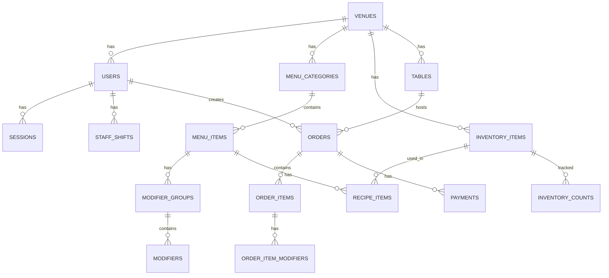

# HOST Database Schema v1
## Complete Database Design for MVP

---

## Database Technology

**Primary Database**: Turso (LibSQL) - SQLite at the edge
**ORM**: Drizzle ORM with TypeScript
**Architecture**: Local-first with sync to cloud

---

## Schema Overview



---

## Core Tables

### 🏢 venues
Primary venue/restaurant information
```sql
CREATE TABLE venues (
    id TEXT PRIMARY KEY DEFAULT (lower(hex(randomblob(16)))),
    name TEXT NOT NULL,
    slug TEXT UNIQUE NOT NULL,
    address TEXT NOT NULL,
    city TEXT NOT NULL,
    state TEXT NOT NULL,
    zip_code TEXT NOT NULL,
    country TEXT DEFAULT 'US',
    phone TEXT NOT NULL,
    email TEXT NOT NULL,
    timezone TEXT DEFAULT 'America/Chicago',
    currency TEXT DEFAULT 'USD',
    tax_rate REAL DEFAULT 0.0825, -- 8.25% default

    -- Business hours JSON
    business_hours TEXT, -- JSON: {monday: {open: "11:00", close: "22:00"}}

    -- Settings
    settings TEXT, -- JSON configuration
    features_enabled TEXT, -- JSON array of enabled features

    -- Subscription
    subscription_tier TEXT DEFAULT 'trial', -- trial, basic, pro, enterprise
    subscription_status TEXT DEFAULT 'active',
    trial_ends_at DATETIME,

    -- Metadata
    created_at DATETIME DEFAULT CURRENT_TIMESTAMP,
    updated_at DATETIME DEFAULT CURRENT_TIMESTAMP,
    deleted_at DATETIME,

    CHECK (tax_rate >= 0 AND tax_rate <= 1)
);

CREATE INDEX idx_venues_slug ON venues(slug);
CREATE INDEX idx_venues_subscription ON venues(subscription_status, subscription_tier);
```

### 👤 users
Staff and user accounts
```sql
CREATE TABLE users (
    id TEXT PRIMARY KEY DEFAULT (lower(hex(randomblob(16)))),
    venue_id TEXT NOT NULL,
    email TEXT UNIQUE NOT NULL,
    username TEXT NOT NULL,
    password_hash TEXT NOT NULL,

    -- Profile
    first_name TEXT NOT NULL,
    last_name TEXT NOT NULL,
    phone TEXT,
    avatar_url TEXT,

    -- Role & Permissions
    role TEXT NOT NULL, -- admin, manager, server, bartender, host
    permissions TEXT, -- JSON array of specific permissions
    pin_code TEXT, -- 4-6 digit PIN for quick access

    -- Employment
    employee_id TEXT,
    hire_date DATE,
    hourly_rate REAL,

    -- Status
    status TEXT DEFAULT 'active', -- active, inactive, terminated
    last_login_at DATETIME,
    password_changed_at DATETIME,

    -- Metadata
    created_at DATETIME DEFAULT CURRENT_TIMESTAMP,
    updated_at DATETIME DEFAULT CURRENT_TIMESTAMP,
    deleted_at DATETIME,

    FOREIGN KEY (venue_id) REFERENCES venues(id),
    CHECK (role IN ('admin', 'manager', 'server', 'bartender', 'host', 'kitchen'))
);

CREATE INDEX idx_users_venue ON users(venue_id);
CREATE INDEX idx_users_email ON users(email);
CREATE INDEX idx_users_pin ON users(venue_id, pin_code);
```

### 🔐 sessions
Authentication sessions
```sql
CREATE TABLE sessions (
    id TEXT PRIMARY KEY,
    user_id TEXT NOT NULL,
    venue_id TEXT NOT NULL,
    device_info TEXT, -- User agent, device type
    ip_address TEXT,
    expires_at DATETIME NOT NULL,
    created_at DATETIME DEFAULT CURRENT_TIMESTAMP,

    FOREIGN KEY (user_id) REFERENCES users(id) ON DELETE CASCADE,
    FOREIGN KEY (venue_id) REFERENCES venues(id)
);

CREATE INDEX idx_sessions_user ON sessions(user_id);
CREATE INDEX idx_sessions_expires ON sessions(expires_at);
```

---

## Menu Management

### 📁 menu_categories
Menu organization
```sql
CREATE TABLE menu_categories (
    id TEXT PRIMARY KEY DEFAULT (lower(hex(randomblob(16)))),
    venue_id TEXT NOT NULL,
    name TEXT NOT NULL,
    slug TEXT NOT NULL,
    description TEXT,

    -- Hierarchy
    parent_category_id TEXT,
    sort_order INTEGER DEFAULT 0,

    -- Display
    icon TEXT,
    color TEXT,
    image_url TEXT,

    -- Availability
    is_active BOOLEAN DEFAULT TRUE,
    available_start_time TIME,
    available_end_time TIME,
    available_days TEXT, -- JSON array: ["monday", "tuesday"]

    -- Metadata
    created_at DATETIME DEFAULT CURRENT_TIMESTAMP,
    updated_at DATETIME DEFAULT CURRENT_TIMESTAMP,
    deleted_at DATETIME,

    FOREIGN KEY (venue_id) REFERENCES venues(id),
    FOREIGN KEY (parent_category_id) REFERENCES menu_categories(id),
    UNIQUE (venue_id, slug)
);

CREATE INDEX idx_menu_categories_venue ON menu_categories(venue_id, is_active);
CREATE INDEX idx_menu_categories_parent ON menu_categories(parent_category_id);
```

### 🍔 menu_items
Individual menu items
```sql
CREATE TABLE menu_items (
    id TEXT PRIMARY KEY DEFAULT (lower(hex(randomblob(16)))),
    venue_id TEXT NOT NULL,
    category_id TEXT NOT NULL,

    -- Basic Info
    name TEXT NOT NULL,
    slug TEXT NOT NULL,
    description TEXT,
    short_description TEXT,

    -- Pricing
    base_price REAL NOT NULL,
    happy_hour_price REAL,
    cost REAL, -- Calculated from recipe
    target_margin REAL,

    -- Display
    image_url TEXT,
    thumbnail_url TEXT,
    tags TEXT, -- JSON array: ["spicy", "vegetarian", "gluten-free"]
    sort_order INTEGER DEFAULT 0,

    -- Inventory
    track_inventory BOOLEAN DEFAULT FALSE,
    quantity_on_hand INTEGER DEFAULT 0,
    alert_threshold INTEGER DEFAULT 10,

    -- Availability
    is_active BOOLEAN DEFAULT TRUE,
    is_86 BOOLEAN DEFAULT FALSE, -- Quick out-of-stock flag
    available_start_time TIME,
    available_end_time TIME,
    available_days TEXT, -- JSON array

    -- Prep & Kitchen
    prep_time_minutes INTEGER,
    station TEXT, -- bar, kitchen, expo
    printer_id TEXT,

    -- Analytics
    popularity_score REAL DEFAULT 0,
    total_sold INTEGER DEFAULT 0,

    -- Metadata
    created_at DATETIME DEFAULT CURRENT_TIMESTAMP,
    updated_at DATETIME DEFAULT CURRENT_TIMESTAMP,
    deleted_at DATETIME,

    FOREIGN KEY (venue_id) REFERENCES venues(id),
    FOREIGN KEY (category_id) REFERENCES menu_categories(id),
    UNIQUE (venue_id, slug),
    CHECK (base_price >= 0),
    CHECK (cost >= 0)
);

CREATE INDEX idx_menu_items_venue ON menu_items(venue_id, is_active);
CREATE INDEX idx_menu_items_category ON menu_items(category_id);
CREATE INDEX idx_menu_items_86 ON menu_items(venue_id, is_86);
```

### 🎛️ modifier_groups
Modifier group definitions
```sql
CREATE TABLE modifier_groups (
    id TEXT PRIMARY KEY DEFAULT (lower(hex(randomblob(16)))),
    venue_id TEXT NOT NULL,
    menu_item_id TEXT NOT NULL,

    name TEXT NOT NULL,
    description TEXT,

    -- Rules
    min_selections INTEGER DEFAULT 0,
    max_selections INTEGER,
    is_required BOOLEAN DEFAULT FALSE,

    -- Display
    sort_order INTEGER DEFAULT 0,
    display_type TEXT DEFAULT 'list', -- list, grid, dropdown

    -- Metadata
    created_at DATETIME DEFAULT CURRENT_TIMESTAMP,
    updated_at DATETIME DEFAULT CURRENT_TIMESTAMP,

    FOREIGN KEY (venue_id) REFERENCES venues(id),
    FOREIGN KEY (menu_item_id) REFERENCES menu_items(id) ON DELETE CASCADE,
    CHECK (min_selections >= 0),
    CHECK (max_selections IS NULL OR max_selections >= min_selections)
);

CREATE INDEX idx_modifier_groups_item ON modifier_groups(menu_item_id);
```

### 🔧 modifiers
Individual modifiers
```sql
CREATE TABLE modifiers (
    id TEXT PRIMARY KEY DEFAULT (lower(hex(randomblob(16)))),
    venue_id TEXT NOT NULL,
    group_id TEXT NOT NULL,

    name TEXT NOT NULL,
    price_adjustment REAL DEFAULT 0, -- Can be negative for removals

    -- Display
    description TEXT,
    sort_order INTEGER DEFAULT 0,
    is_default BOOLEAN DEFAULT FALSE,

    -- Availability
    is_active BOOLEAN DEFAULT TRUE,
    quantity_available INTEGER,

    -- Metadata
    created_at DATETIME DEFAULT CURRENT_TIMESTAMP,
    updated_at DATETIME DEFAULT CURRENT_TIMESTAMP,

    FOREIGN KEY (venue_id) REFERENCES venues(id),
    FOREIGN KEY (group_id) REFERENCES modifier_groups(id) ON DELETE CASCADE
);

CREATE INDEX idx_modifiers_group ON modifiers(group_id, is_active);
```

---

## Order Management

### 🪑 tables
Restaurant tables/sections
```sql
CREATE TABLE tables (
    id TEXT PRIMARY KEY DEFAULT (lower(hex(randomblob(16)))),
    venue_id TEXT NOT NULL,

    number TEXT NOT NULL,
    name TEXT,
    section TEXT,

    -- Capacity
    min_capacity INTEGER DEFAULT 1,
    max_capacity INTEGER NOT NULL,

    -- Status
    status TEXT DEFAULT 'available', -- available, occupied, reserved, cleaning
    current_order_id TEXT,

    -- Position (for floor plan)
    position_x INTEGER,
    position_y INTEGER,
    shape TEXT DEFAULT 'square', -- square, round, rectangle

    -- Metadata
    created_at DATETIME DEFAULT CURRENT_TIMESTAMP,
    updated_at DATETIME DEFAULT CURRENT_TIMESTAMP,

    FOREIGN KEY (venue_id) REFERENCES venues(id),
    UNIQUE (venue_id, number),
    CHECK (status IN ('available', 'occupied', 'reserved', 'cleaning'))
);

CREATE INDEX idx_tables_venue ON tables(venue_id, status);
```

### 📝 orders
Order transactions
```sql
CREATE TABLE orders (
    id TEXT PRIMARY KEY DEFAULT (lower(hex(randomblob(16)))),
    venue_id TEXT NOT NULL,
    order_number INTEGER NOT NULL, -- Daily incrementing number

    -- Assignment
    table_id TEXT,
    server_id TEXT NOT NULL,

    -- Type & Status
    order_type TEXT NOT NULL, -- dine_in, takeout, delivery, bar
    status TEXT DEFAULT 'open', -- open, sent, completed, voided

    -- Customer
    customer_name TEXT,
    customer_phone TEXT,
    customer_email TEXT,
    guest_count INTEGER DEFAULT 1,

    -- Totals (cached for performance)
    subtotal REAL DEFAULT 0,
    tax_amount REAL DEFAULT 0,
    tip_amount REAL DEFAULT 0,
    discount_amount REAL DEFAULT 0,
    total_amount REAL DEFAULT 0,

    -- Timestamps
    opened_at DATETIME DEFAULT CURRENT_TIMESTAMP,
    sent_at DATETIME,
    completed_at DATETIME,
    closed_at DATETIME,

    -- Notes
    notes TEXT,
    void_reason TEXT,
    voided_by TEXT,

    -- Metadata
    created_at DATETIME DEFAULT CURRENT_TIMESTAMP,
    updated_at DATETIME DEFAULT CURRENT_TIMESTAMP,

    FOREIGN KEY (venue_id) REFERENCES venues(id),
    FOREIGN KEY (table_id) REFERENCES tables(id),
    FOREIGN KEY (server_id) REFERENCES users(id),
    CHECK (order_type IN ('dine_in', 'takeout', 'delivery', 'bar')),
    CHECK (status IN ('open', 'sent', 'completed', 'voided'))
);

CREATE INDEX idx_orders_venue_date ON orders(venue_id, created_at);
CREATE INDEX idx_orders_table ON orders(table_id, status);
CREATE INDEX idx_orders_server ON orders(server_id, created_at);
CREATE INDEX idx_orders_status ON orders(venue_id, status);
```

### 🍕 order_items
Line items in orders
```sql
CREATE TABLE order_items (
    id TEXT PRIMARY KEY DEFAULT (lower(hex(randomblob(16)))),
    order_id TEXT NOT NULL,
    menu_item_id TEXT NOT NULL,

    -- Details
    quantity INTEGER DEFAULT 1,
    unit_price REAL NOT NULL,
    total_price REAL NOT NULL,

    -- Status
    status TEXT DEFAULT 'pending', -- pending, sent, preparing, ready, delivered, voided
    sent_at DATETIME,
    ready_at DATETIME,
    delivered_at DATETIME,

    -- Kitchen/Bar
    station TEXT,
    prep_time_minutes INTEGER,
    fire_course INTEGER, -- For coursing

    -- Special Instructions
    notes TEXT,
    is_comp BOOLEAN DEFAULT FALSE,
    comp_reason TEXT,
    comp_by TEXT,

    -- Split Check
    split_group INTEGER,

    -- Metadata
    created_at DATETIME DEFAULT CURRENT_TIMESTAMP,
    updated_at DATETIME DEFAULT CURRENT_TIMESTAMP,

    FOREIGN KEY (order_id) REFERENCES orders(id) ON DELETE CASCADE,
    FOREIGN KEY (menu_item_id) REFERENCES menu_items(id),
    CHECK (quantity > 0),
    CHECK (status IN ('pending', 'sent', 'preparing', 'ready', 'delivered', 'voided'))
);

CREATE INDEX idx_order_items_order ON order_items(order_id);
CREATE INDEX idx_order_items_status ON order_items(status, station);
```

### 🎯 order_item_modifiers
Applied modifiers to order items
```sql
CREATE TABLE order_item_modifiers (
    id TEXT PRIMARY KEY DEFAULT (lower(hex(randomblob(16)))),
    order_item_id TEXT NOT NULL,
    modifier_id TEXT NOT NULL,

    quantity INTEGER DEFAULT 1,
    unit_price REAL DEFAULT 0,
    total_price REAL DEFAULT 0,

    created_at DATETIME DEFAULT CURRENT_TIMESTAMP,

    FOREIGN KEY (order_item_id) REFERENCES order_items(id) ON DELETE CASCADE,
    FOREIGN KEY (modifier_id) REFERENCES modifiers(id)
);

CREATE INDEX idx_order_item_modifiers ON order_item_modifiers(order_item_id);
```

---

## Payment Processing

### 💳 payments
Payment records
```sql
CREATE TABLE payments (
    id TEXT PRIMARY KEY DEFAULT (lower(hex(randomblob(16)))),
    venue_id TEXT NOT NULL,
    order_id TEXT NOT NULL,

    -- Amount
    amount REAL NOT NULL,
    tip_amount REAL DEFAULT 0,

    -- Method
    payment_method TEXT NOT NULL, -- card, cash, check, gift_card, comp
    card_last_four TEXT,
    card_brand TEXT,

    -- Processing
    processor TEXT, -- stripe, manual
    processor_transaction_id TEXT,
    processor_fee REAL,

    -- Status
    status TEXT DEFAULT 'pending', -- pending, completed, failed, refunded

    -- Refunds
    is_refunded BOOLEAN DEFAULT FALSE,
    refund_amount REAL,
    refund_reason TEXT,
    refunded_at DATETIME,
    refunded_by TEXT,

    -- Metadata
    created_at DATETIME DEFAULT CURRENT_TIMESTAMP,
    processed_at DATETIME,

    FOREIGN KEY (venue_id) REFERENCES venues(id),
    FOREIGN KEY (order_id) REFERENCES orders(id),
    CHECK (amount > 0),
    CHECK (payment_method IN ('card', 'cash', 'check', 'gift_card', 'comp')),
    CHECK (status IN ('pending', 'completed', 'failed', 'refunded'))
);

CREATE INDEX idx_payments_order ON payments(order_id);
CREATE INDEX idx_payments_venue_date ON payments(venue_id, created_at);
CREATE INDEX idx_payments_processor ON payments(processor_transaction_id);
```

---

## Inventory Management

### 📦 inventory_items
Inventory stock items
```sql
CREATE TABLE inventory_items (
    id TEXT PRIMARY KEY DEFAULT (lower(hex(randomblob(16)))),
    venue_id TEXT NOT NULL,

    -- Basic Info
    name TEXT NOT NULL,
    sku TEXT,
    barcode TEXT,
    category TEXT NOT NULL, -- liquor, beer, wine, food, supplies
    subcategory TEXT,

    -- Units
    unit_type TEXT NOT NULL, -- bottle, case, keg, pound, each
    unit_size REAL,
    unit_size_uom TEXT, -- ml, l, oz, lb, kg, each
    units_per_case INTEGER,

    -- Stock Levels
    quantity_on_hand REAL DEFAULT 0,
    par_level REAL,
    reorder_point REAL,
    reorder_quantity REAL,

    -- Costs
    unit_cost REAL,
    case_cost REAL,
    last_cost REAL,
    average_cost REAL,

    -- Vendor
    primary_vendor TEXT,
    vendor_item_code TEXT,

    -- Storage
    storage_location TEXT,
    storage_temp TEXT, -- room, cooler, freezer

    -- Metadata
    created_at DATETIME DEFAULT CURRENT_TIMESTAMP,
    updated_at DATETIME DEFAULT CURRENT_TIMESTAMP,
    deleted_at DATETIME,

    FOREIGN KEY (venue_id) REFERENCES venues(id),
    UNIQUE (venue_id, sku),
    CHECK (category IN ('liquor', 'beer', 'wine', 'food', 'supplies'))
);

CREATE INDEX idx_inventory_venue ON inventory_items(venue_id, category);
CREATE INDEX idx_inventory_sku ON inventory_items(venue_id, sku);
CREATE INDEX idx_inventory_low_stock ON inventory_items(venue_id, quantity_on_hand, reorder_point);
```

### 📊 inventory_counts
Physical inventory counts
```sql
CREATE TABLE inventory_counts (
    id TEXT PRIMARY KEY DEFAULT (lower(hex(randomblob(16)))),
    venue_id TEXT NOT NULL,
    inventory_item_id TEXT NOT NULL,

    -- Count Details
    count_date DATE NOT NULL,
    physical_count REAL NOT NULL,
    system_count REAL NOT NULL,
    variance REAL GENERATED ALWAYS AS (physical_count - system_count) STORED,

    -- Audit
    counted_by TEXT NOT NULL,
    verified_by TEXT,
    notes TEXT,

    -- Metadata
    created_at DATETIME DEFAULT CURRENT_TIMESTAMP,

    FOREIGN KEY (venue_id) REFERENCES venues(id),
    FOREIGN KEY (inventory_item_id) REFERENCES inventory_items(id),
    FOREIGN KEY (counted_by) REFERENCES users(id)
);

CREATE INDEX idx_inventory_counts_item ON inventory_counts(inventory_item_id, count_date);
CREATE INDEX idx_inventory_counts_date ON inventory_counts(venue_id, count_date);
```

### 🍹 recipe_items
Recipe ingredients (links menu items to inventory)
```sql
CREATE TABLE recipe_items (
    id TEXT PRIMARY KEY DEFAULT (lower(hex(randomblob(16)))),
    menu_item_id TEXT NOT NULL,
    inventory_item_id TEXT NOT NULL,

    quantity REAL NOT NULL,
    unit_of_measure TEXT NOT NULL, -- oz, ml, each, etc

    -- Cost Calculation
    cost_per_unit REAL,
    total_cost REAL GENERATED ALWAYS AS (quantity * cost_per_unit) STORED,

    -- Metadata
    notes TEXT,
    created_at DATETIME DEFAULT CURRENT_TIMESTAMP,
    updated_at DATETIME DEFAULT CURRENT_TIMESTAMP,

    FOREIGN KEY (menu_item_id) REFERENCES menu_items(id) ON DELETE CASCADE,
    FOREIGN KEY (inventory_item_id) REFERENCES inventory_items(id),
    UNIQUE (menu_item_id, inventory_item_id)
);

CREATE INDEX idx_recipe_items_menu ON recipe_items(menu_item_id);
CREATE INDEX idx_recipe_items_inventory ON recipe_items(inventory_item_id);
```

---

## Staff Management

### ⏰ staff_shifts
Clock in/out and shift tracking
```sql
CREATE TABLE staff_shifts (
    id TEXT PRIMARY KEY DEFAULT (lower(hex(randomblob(16)))),
    venue_id TEXT NOT NULL,
    user_id TEXT NOT NULL,

    -- Shift Times
    scheduled_start DATETIME,
    scheduled_end DATETIME,
    actual_start DATETIME,
    actual_end DATETIME,

    -- Break Tracking
    break_start DATETIME,
    break_end DATETIME,
    total_break_minutes INTEGER DEFAULT 0,

    -- Role & Section
    shift_role TEXT,
    assigned_section TEXT,
    assigned_tables TEXT, -- JSON array of table IDs

    -- Performance
    total_sales REAL DEFAULT 0,
    total_tips REAL DEFAULT 0,
    order_count INTEGER DEFAULT 0,

    -- Status
    status TEXT DEFAULT 'scheduled', -- scheduled, clocked_in, on_break, clocked_out

    -- Metadata
    notes TEXT,
    created_at DATETIME DEFAULT CURRENT_TIMESTAMP,
    updated_at DATETIME DEFAULT CURRENT_TIMESTAMP,

    FOREIGN KEY (venue_id) REFERENCES venues(id),
    FOREIGN KEY (user_id) REFERENCES users(id),
    CHECK (status IN ('scheduled', 'clocked_in', 'on_break', 'clocked_out'))
);

CREATE INDEX idx_shifts_venue_date ON staff_shifts(venue_id, scheduled_start);
CREATE INDEX idx_shifts_user ON staff_shifts(user_id, actual_start);
CREATE INDEX idx_shifts_active ON staff_shifts(venue_id, status);
```

---

## Reporting & Analytics

### 📈 daily_sales_summary
Pre-aggregated daily sales data
```sql
CREATE TABLE daily_sales_summary (
    id TEXT PRIMARY KEY DEFAULT (lower(hex(randomblob(16)))),
    venue_id TEXT NOT NULL,
    summary_date DATE NOT NULL,

    -- Order Metrics
    total_orders INTEGER DEFAULT 0,
    dine_in_orders INTEGER DEFAULT 0,
    takeout_orders INTEGER DEFAULT 0,
    bar_orders INTEGER DEFAULT 0,

    -- Sales Metrics
    gross_sales REAL DEFAULT 0,
    net_sales REAL DEFAULT 0,
    total_tax REAL DEFAULT 0,
    total_tips REAL DEFAULT 0,
    total_discounts REAL DEFAULT 0,

    -- Payment Breakdown
    cash_sales REAL DEFAULT 0,
    card_sales REAL DEFAULT 0,
    other_sales REAL DEFAULT 0,

    -- Operational Metrics
    average_order_value REAL DEFAULT 0,
    average_order_time_minutes INTEGER DEFAULT 0,
    table_turnover_rate REAL DEFAULT 0,

    -- Staff Metrics
    labor_cost REAL DEFAULT 0,
    labor_percentage REAL DEFAULT 0,

    -- Inventory
    food_cost REAL DEFAULT 0,
    beverage_cost REAL DEFAULT 0,
    total_cost REAL DEFAULT 0,

    -- Metadata
    created_at DATETIME DEFAULT CURRENT_TIMESTAMP,
    updated_at DATETIME DEFAULT CURRENT_TIMESTAMP,

    FOREIGN KEY (venue_id) REFERENCES venues(id),
    UNIQUE (venue_id, summary_date)
);

CREATE INDEX idx_daily_summary ON daily_sales_summary(venue_id, summary_date);
```

### 📋 audit_logs
System audit trail
```sql
CREATE TABLE audit_logs (
    id TEXT PRIMARY KEY DEFAULT (lower(hex(randomblob(16)))),
    venue_id TEXT NOT NULL,
    user_id TEXT,

    -- Event Details
    event_type TEXT NOT NULL, -- order_void, price_override, refund, etc
    entity_type TEXT NOT NULL, -- order, payment, menu_item, etc
    entity_id TEXT NOT NULL,

    -- Changes
    old_values TEXT, -- JSON of previous values
    new_values TEXT, -- JSON of new values

    -- Context
    ip_address TEXT,
    user_agent TEXT,
    notes TEXT,

    -- Metadata
    created_at DATETIME DEFAULT CURRENT_TIMESTAMP,

    FOREIGN KEY (venue_id) REFERENCES venues(id),
    FOREIGN KEY (user_id) REFERENCES users(id)
);

CREATE INDEX idx_audit_venue ON audit_logs(venue_id, created_at);
CREATE INDEX idx_audit_entity ON audit_logs(entity_type, entity_id);
CREATE INDEX idx_audit_user ON audit_logs(user_id, created_at);
```

---

## Migration Strategy

### Initial Setup (Week 1)
```sql
-- Run migrations in order:
001_create_venues.sql
002_create_users_and_auth.sql
003_create_menu_structure.sql
004_create_order_management.sql
005_create_payments.sql
006_create_inventory.sql
007_create_reporting.sql
008_create_indexes.sql
009_seed_demo_data.sql
```

### Data Seeding Strategy
1. Create demo venue
2. Add admin user
3. Import sample menu (50-100 items)
4. Generate historical orders (30 days)
5. Create inventory items from recipes

### Performance Optimizations
- Implement table partitioning for orders by month
- Create materialized views for common reports
- Use trigger-based cache invalidation
- Implement read replicas for reporting

### Backup Strategy
- Continuous replication to S3
- Point-in-time recovery (30 days)
- Daily automated backups
- Geo-redundant storage

---

## Database Access Patterns

### High-Frequency Queries
1. **Order Creation**: INSERT order, SELECT menu_items
2. **Payment Processing**: UPDATE orders, INSERT payments
3. **Live Orders View**: SELECT orders WHERE status = 'open'
4. **Inventory Depletion**: UPDATE inventory_items on order completion

### Optimization Strategies
- Use connection pooling (min: 5, max: 20)
- Implement query result caching (Redis)
- Batch write operations where possible
- Use prepared statements for all queries

---

## Security Considerations

### Data Encryption
- Encrypt PII fields at rest
- Use column-level encryption for sensitive data
- Implement field-level access control

### Access Control
- Row-level security for multi-venue
- Role-based access via application layer
- Audit all data modifications

### Compliance
- PCI-DSS: Never store full card numbers
- GDPR: Implement right-to-forget
- Data retention: 7 years for financial records

---

*Last Updated: September 29, 2025*
*Database Version: 0.1.0-alpha*
*Status: Ready for Implementation*