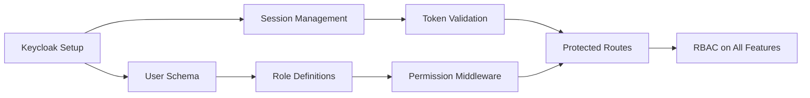
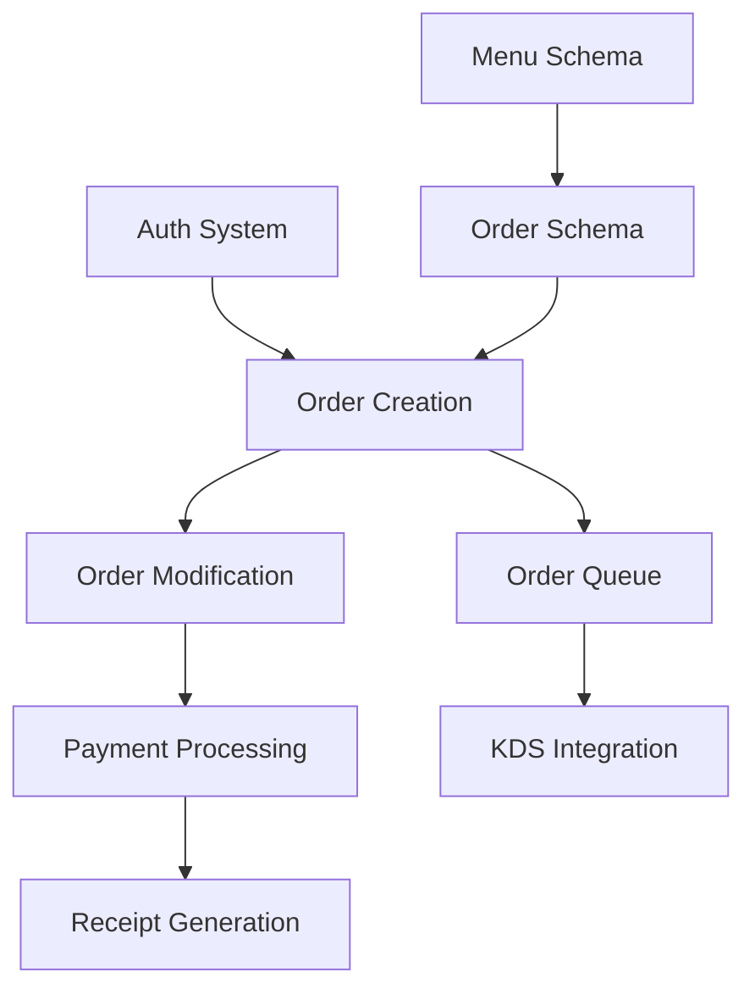
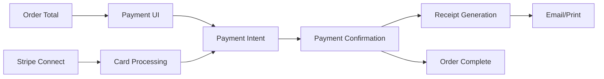
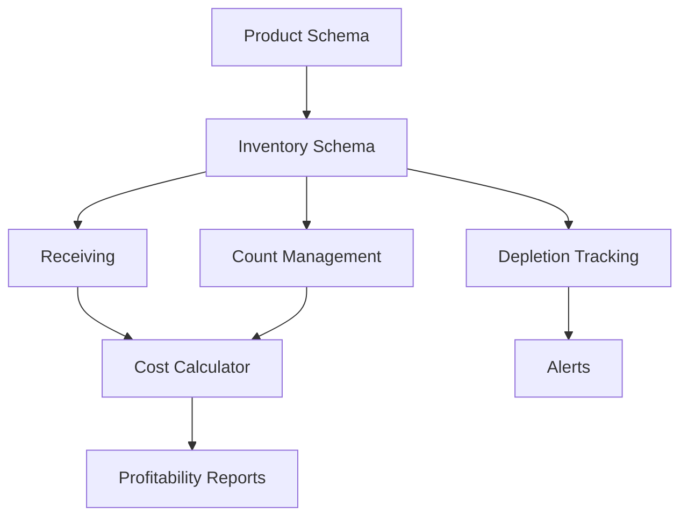
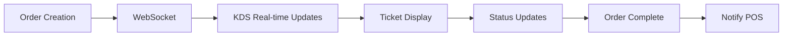
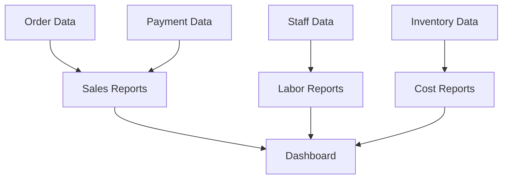

# Technical Dependencies & Integration Map
## HOST POS System Dependency Tracking

---

## Purpose

This document tracks technical dependencies between features, components, and systems in the HOST POS project. Use this to:
- Identify critical path items
- Understand what can be developed in parallel
- Prevent integration conflicts
- Plan development sequence
- Identify blockers early

---

## Dependency Matrix

### Core Foundation Dependencies

#### Infrastructure Layer (Week 1)
**Status**: 🟡 In Progress

| Component | Depends On | Blocks | Status |
|-----------|-----------|--------|--------|
| Monorepo Setup (Turborepo) | None | All other features | ✅ Complete |
| TypeScript Configuration | Monorepo | All TypeScript code | ✅ Complete |
| Turso Database Connection | None | All database operations | 🟡 In Progress |
| Drizzle ORM Setup | Database Connection | Schema, migrations | 🟡 In Progress |
| Keycloak Integration | Docker, Database | Authentication, RBAC | ⬜ Not Started |
| Redis Session Store | Docker | Session management | ⬜ Not Started |
| tRPC v11 Setup | TypeScript 5.7.2+ | All API endpoints | ⬜ Not Started |
| CI/CD Pipeline | Git repo | Automated testing | ⬜ Not Started |

**Critical Path**: Database → ORM → Authentication → API Layer

---

#### UI Foundation Layer (Week 2)
**Status**: ⬜ Not Started

| Component | Depends On | Blocks | Status |
|-----------|-----------|--------|--------|
| SvelteKit Apps | Monorepo | All UI features | ⬜ Not Started |
| Tailwind CSS 4 | SvelteKit | All styling | ⬜ Not Started |
| Component Library | Tailwind | All UI components | ⬜ Not Started |
| Form Validation | Zod, Components | All forms | ⬜ Not Started |
| Layout System | Components | Navigation, shell | ⬜ Not Started |
| Error Handling | SvelteKit | Error boundaries | ⬜ Not Started |
| Loading States | Components | Async operations | ⬜ Not Started |

**Critical Path**: SvelteKit → Tailwind → Components → Forms

---

### Feature Dependencies

#### Authentication & Authorization
**Status**: ⬜ Not Started
**Sprint**: Week 1 (Infrastructure)

| Feature | Depends On | Required By | Priority |
|---------|-----------|------------|----------|
| Keycloak Configuration | Docker, PostgreSQL | All auth features | 🔴 Critical |
| User/Role Schema | Drizzle ORM | Registration, login | 🔴 Critical |
| Session Management | Redis, Keycloak | Token refresh | 🔴 Critical |
| Token Validation | Keycloak | Protected routes | 🔴 Critical |
| Permission Middleware | Roles, tokens | RBAC | 🔴 Critical |
| Login UI | Auth services | All features | 🔴 Critical |
| Registration Flow | Auth services | User onboarding | 🟠 High |
| Password Reset | Auth services, Email | User management | 🟠 High |

---

#### Order Management
**Status**: ⬜ Not Started
**Sprint**: Week 4 (Core POS)

| Feature | Depends On | Required By | Priority |
|---------|-----------|------------|----------|
| Menu Schema | Drizzle ORM | Order items | 🔴 Critical |
| Table Management | Database | Order assignment | 🔴 Critical |
| Order Creation API | Menu, Auth | All order ops | 🔴 Critical |
| Order Modification | Order creation | Split check, void | 🔴 Critical |
| Order Status Updates | Order creation | Kitchen workflow | 🔴 Critical |
| Split Check Logic | Order modification | Multiple payments | 🟠 High |
| Void/Comp Workflow | Order modification | Corrections | 🟠 High |
| Order History | Order creation | Reporting | 🟡 Medium |

---

#### Payment Processing
**Status**: ⬜ Not Started
**Sprint**: Week 5 (Core POS)

| Feature | Depends On | Required By | Priority |
|---------|-----------|------------|----------|
| Stripe Connect Setup | Stripe account | All payments | 🔴 Critical |
| Payment Schema | Drizzle ORM | Payment tracking | 🔴 Critical |
| Card Processing | Stripe, payment schema | Card payments | 🔴 Critical |
| Cash Handling | Payment schema | Cash payments | 🔴 Critical |
| Tip Management | Payment flow | Gratuity | 🔴 Critical |
| Receipt Generation | Order, payment | Customer receipt | 🔴 Critical |
| Refund Processing | Payment history | Refunds | 🟠 High |
| Split Payment | Payment flow | Multiple payment methods | 🟠 High |
| Payment Reconciliation | Payment history | Daily reports | 🟡 Medium |

---

#### Inventory Management
**Status**: ⬜ Not Started
**Sprint**: Week 6 (Core POS)

| Feature | Depends On | Required By | Priority |
|---------|-----------|------------|----------|
| Product Schema | Drizzle ORM | Inventory tracking | 🔴 Critical |
| Inventory Schema | Product schema | Stock levels | 🔴 Critical |
| Receiving Workflow | Inventory schema | Stock in | 🟠 High |
| Count Management | Inventory schema | Audits | 🟠 High |
| Depletion Tracking | Order system | Auto-depletion | 🟠 High |
| Par Level Alerts | Inventory schema | Reordering | 🟡 Medium |
| Cost Calculator | Inventory, recipes | Profitability | 🟡 Medium |
| Recipe Management | Inventory, menu | Cost tracking | 🟡 Medium |

---

#### Kitchen Display System (KDS)
**Status**: ⬜ Not Started
**Sprint**: Week 7 (KDS)

| Feature | Depends On | Required By | Priority |
|---------|-----------|------------|----------|
| WebSocket Server | Infrastructure | Real-time updates | 🔴 Critical |
| Order Queue System | Order management | Ticket routing | 🔴 Critical |
| Ticket Display | KDS app, orders | Kitchen workflow | 🔴 Critical |
| Status Updates | WebSocket | POS sync | 🔴 Critical |
| Prep Time Tracking | Orders, KDS | Kitchen metrics | 🟠 High |
| Ticket Routing | Order, kitchen stations | Kitchen efficiency | 🟠 High |
| Bump Bar Support | KDS, hardware | Physical bump | 🟡 Medium |

---

#### Reporting & Analytics
**Status**: ⬜ Not Started
**Sprint**: Week 8 (Reports)

| Feature | Depends On | Required By | Priority |
|---------|-----------|------------|----------|
| Sales Reports | Order, payment data | Management | 🟠 High |
| Labor Reports | Staff, shift data | Scheduling | 🟠 High |
| Inventory Reports | Inventory data | Cost control | 🟠 High |
| Tax Reports | Payment data | Compliance | 🟠 High |
| Custom Reports | Report engine | Business intelligence | 🟡 Medium |
| Export Functions | Reports | External analysis | 🟡 Medium |
| Real-time Dashboard | All data sources | Live monitoring | 🟡 Medium |

---

## External Service Dependencies

### Third-Party Services

| Service | Purpose | Critical Path | Fallback |
|---------|---------|---------------|----------|
| **Turso Cloud** | Primary database | 🔴 Yes | Local SQLite |
| **Keycloak** | Authentication | 🔴 Yes | None (must be up) |
| **Stripe** | Payment processing | 🔴 Yes | Manual/offline mode |
| **Redis/Upstash** | Session/cache | 🟠 High | In-memory store |
| **Cloudflare** | Edge functions, CDN | 🟡 Medium | Direct server |
| **Sentry** | Error tracking | 🟡 Medium | Console logs |
| **Email Service** | Receipts, notifications | 🟡 Medium | Queue for later |
| **SMS Service** | Alerts, notifications | 🟢 Low | Email fallback |

---

## Development Phase Dependencies

### Phase 1: Foundation (Weeks 1-3)
**Blockers**: None
**Enables**: All subsequent development

- Week 1: Infrastructure ⚠️ **CRITICAL PATH**
- Week 2: UI Foundation
- Week 3: Data Models & APIs

**Parallel Work Available**:
- Documentation updates
- Design system refinement
- Test framework setup

---

### Phase 2: Core POS (Weeks 4-6)
**Blockers**: Phase 1 must be complete
**Enables**: Orders, payments, inventory

- Week 4: Menu & Orders ⚠️ **CRITICAL PATH**
- Week 5: Payments ⚠️ **CRITICAL PATH**
- Week 6: Inventory

**Parallel Work Available**:
- KDS UI mockups
- Report designs
- Admin dashboard

---

### Phase 3: Extended Features (Weeks 7-9)
**Blockers**: Phase 2 orders/payments complete
**Enables**: Full restaurant workflow

- Week 7: Kitchen Display System
- Week 8: Reporting & Analytics
- Week 9: Staff & Scheduling

**Parallel Work Available**:
- Mobile optimization
- Advanced features
- Integrations

---

### Phase 4: Polish & Launch (Weeks 10-12)
**Blockers**: Phase 3 core features complete
**Enables**: Production launch

- Week 10: E2E Testing
- Week 11: Performance Optimization
- Week 12: Documentation & Training

---

## Critical Path Summary

### Absolute Blockers (Must Complete First)
1. ✅ Monorepo setup
2. 🟡 Database + Drizzle ORM
3. ⬜ Authentication (Keycloak)
4. ⬜ API layer (tRPC v11)
5. ⬜ UI foundation (SvelteKit + components)

### High Priority (Can't Ship Without)
6. ⬜ Order management
7. ⬜ Payment processing
8. ⬜ Menu management
9. ⬜ Table management
10. ⬜ Receipt generation

### Medium Priority (MVP Features)
11. ⬜ Inventory tracking
12. ⬜ Kitchen display
13. ⬜ Basic reporting
14. ⬜ Staff management

---

## Parallel Development Opportunities

### What Can Be Built Simultaneously?

**After Week 1 (Infrastructure Complete)**:
- ✅ Frontend components (no backend needed)
- ✅ UI design system
- ✅ Test framework and factories
- ✅ Documentation

**After Week 3 (APIs Ready)**:
- ✅ Order management UI
- ✅ Payment UI
- ✅ Menu management UI
- ✅ Reports UI (with mock data)

**After Week 5 (Orders + Payments Complete)**:
- ✅ Inventory system
- ✅ KDS system
- ✅ Reporting engine
- ✅ Advanced features

---

## Integration Points

### Key Integration Interfaces

| Integration | Systems Involved | Data Flow | Complexity |
|-------------|------------------|-----------|------------|
| **POS → KDS** | WebSocket, Orders | Real-time order updates | 🟠 Medium |
| **POS → Payment** | Stripe API, Orders | Payment processing | 🔴 High |
| **Auth → All** | Keycloak, Sessions | Token validation | 🔴 High |
| **Inventory → Orders** | Auto-depletion | Stock reduction | 🟡 Low |
| **Reports → All Data** | Database queries | Read-only aggregation | 🟡 Low |
| **Admin → All** | Management APIs | CRUD operations | 🟡 Low |

---

## How to Use This Document

### For Planning
1. Identify what needs to be built
2. Check dependencies in this doc
3. Ensure prerequisites are complete
4. Plan parallel work where possible

### For Development
1. Before starting feature, verify dependencies complete
2. Notify downstream features when yours is done
3. Update status in this doc
4. Flag blockers immediately

### For Troubleshooting
1. Feature not working? Check if dependencies are deployed
2. Integration failing? Verify both systems are on compatible versions
3. Stuck? Look for parallel work to unblock progress

---

## Status Legend

- ✅ **Complete**: Feature is done and deployed
- 🟡 **In Progress**: Active development
- ⬜ **Not Started**: Queued for development
- ⏸️ **Blocked**: Waiting on dependency
- ⚠️ **At Risk**: Dependency concerns or issues
- 🔴 **Critical**: Must complete ASAP
- 🟠 **High**: Important for MVP
- 🟡 **Medium**: Nice to have for MVP
- 🟢 **Low**: Post-MVP enhancement

---

## Update Schedule

**Update Frequency**: Weekly (end of each sprint)
**Owner**: Tech Lead
**Review**: Team standup on Mondays

**Last Updated**: 2025-09-29
**Current Phase**: Foundation (Week 1)
**Next Milestone**: Complete infrastructure setup

---

## Related Documents

- `docs/02-technical-roadmap.md` - Detailed week-by-week plan
- `docs/user-stories.md` - Feature requirements
- `docs/architecture.md` - System design
- `docs/PROGRESS.md` - Current implementation status