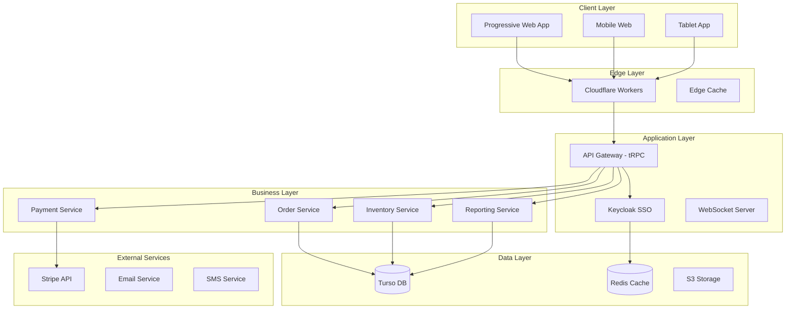
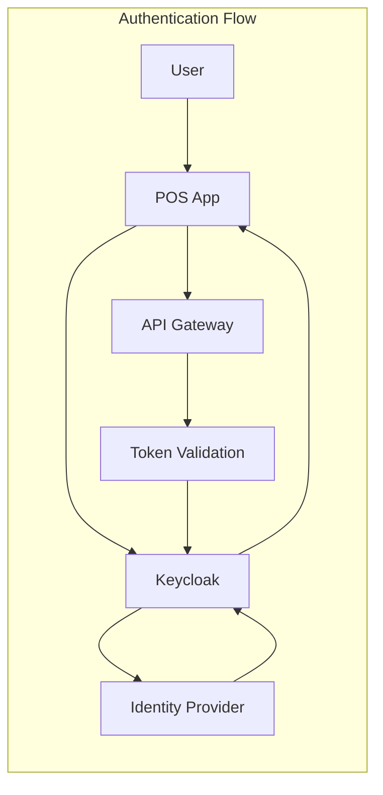

# HOST System Architecture
## User-Centered Design & Technical Implementation

---

## UX/UI Design Foundation

> "Good design is actually a lot harder to notice than poor design, in part because good designs fit our needs so well that the design is invisible." - Don Norman

### Core Design Principles

Our architecture is built on proven UX laws that drive every technical decision:

#### 1. **Fitts's Law**: Optimized Touch Targets
- Minimum 44x44px touch targets (WCAG 2.1 AA)
- Critical POS buttons: 80x80px for speed and accuracy
- Strategic placement reduces movement distance

#### 2. **Hick's Law**: Simplified Decision Making
- Maximum 7 visible menu categories
- Progressive disclosure for complex menus
- Smart grouping by frequency of use

#### 3. **Miller's Law**: Information Chunking
- Orders grouped in 5-7 item chunks
- Phone numbers formatted as XXX-XXX-XXXX
- Receipts organized by logical sections

#### 4. **Doherty Threshold**: Sub-400ms Response
- Optimistic UI updates for instant feedback
- Edge caching for near-instant menu loads
- Background sync for non-critical operations

#### 5. **Aesthetic-Usability Effect**: Beautiful AND Functional
- Consistent visual hierarchy
- Pleasant color palette with high contrast
- Smooth animations that enhance perception

### Accessibility First

**WCAG 2.1 AA Compliance Built-In:**
- Keyboard navigation for all interactions
- Screen reader optimized markup
- High contrast mode support
- Focus indicators on all interactive elements

### Performance Targets

| Metric | Target | Measure |
|--------|--------|---------|
| First Contentful Paint | < 1.0s | Lighthouse |
| Time to Interactive | < 2.0s | Lighthouse |
| API Response (p95) | < 200ms | Monitoring |
| Touch Response | < 100ms | User timing |
| Order Completion | < 30s | Analytics |

---

## System Overview

### High-Level Architecture



---

## Technology Stack

### Frontend
- **Framework**: Svelte 5 with TypeScript
- **Meta-Framework**: SvelteKit (latest)
- **Build Tool**: Vite (via SvelteKit)
- **Styling**: Tailwind CSS 4 + CSS Variables
- **State Management**: Svelte Stores + Context API
- **Routing**: SvelteKit File-based Router
- **Forms**: SvelteKit Form Actions + Zod
- **Animations**: Svelte Transitions + Motion
- **Design System**: Material Design 3 via m3-svelte
- **Testing**: Vitest + Svelte Testing Library + Playwright

### Backend
- **Runtime**: Node.js 24 LTS
- **Framework**: SvelteKit (Server-side)
- **API Layer**: SvelteKit API Routes + tRPC (optional)
- **Authentication**: Keycloak 25.0 LTS (OpenID Connect/OAuth 2.0)
- **Database ORM**: Drizzle ORM
- **Validation**: Zod
- **Testing**: Vitest + Supertest

### Infrastructure
- **Database**: Turso (LibSQL) - Production-ready edge database
  - Global replication with sub-10ms reads
  - Built on SQLite for proven reliability
  - Automatic backups and point-in-time recovery
- **Cache**: Redis / Upstash
- **File Storage**: S3 / Cloudflare R2
- **Edge Functions**: Cloudflare Workers
- **Hosting**: Vercel / Railway
- **Monitoring**: Sentry + Datadog

---

## Design System

### Material Design 3 (MD3)

We use **Material Design 3** as our primary design system, implemented via the native Svelte library **m3-svelte**. This decision provides comprehensive component coverage, built-in accessibility, and optimal performance for POS environments.

#### Why Material Design 3?

**Decision Rationale** (see [ADR-003](adr/ADR-003-material-design-3.md)):

1. **Comprehensive Component Library**: 50+ production-ready components covering all POS needs
2. **Native Svelte Implementation**: Built specifically for Svelte 5 with runes, no wrapper overhead
3. **Superior Performance**: ~150KB bundle size (3x smaller than official @material/web)
4. **Built-in Accessibility**: WCAG 2.1 AA compliance out of the box
5. **Touch-Optimized**: Material Design 3 specifications include proper touch target sizing (48px+ minimum)
6. **Dynamic Theming**: HCT color system generates accessible palettes from brand colors
7. **Industry Standard**: Familiar, professional design language users recognize

#### Component Library

**Available Components** (50+):

**Buttons & Actions**:
- Button (filled, outlined, text, elevated, tonal)
- FAB (Floating Action Button)
- Icon Button
- Segmented Button

**Forms & Input**:
- TextField (filled, outlined)
- DateField, TimeField
- Select, Autocomplete
- Checkbox, Radio, Switch
- Slider, Range Slider

**Navigation**:
- AppBar (Top App Bar)
- Navigation Drawer
- Navigation Rail
- Bottom Navigation
- Tabs

**Containers**:
- Card (elevated, filled, outlined)
- Dialog (modal, fullscreen)
- Bottom Sheet, Side Sheet
- Menu, Menu Item
- Tooltip

**Data Display**:
- List, List Item
- DataTable
- Chips (input, filter, suggestion, assist)
- Badge
- Divider

**Feedback**:
- Snackbar (toast notifications)
- Progress Indicator (circular, linear)
- Skeleton Loader

#### Design Tokens

Material Design 3 uses a comprehensive token system for consistency:

**Color System** (HCT - Hue, Chroma, Tone):
```typescript
// HOST Brand Color: Tailwind blue-600 (#2563eb)
export const HOST_THEME = {
  primary: '#2563eb',
  // MD3 generates 13 tonal variants for light/dark themes
  primaryContainer: '#dbeafe',
  onPrimary: '#ffffff',
  onPrimaryContainer: '#172554',

  // Semantic colors
  error: '#b91c1c',
  warning: '#ea580c',
  success: '#16a34a',
  info: '#0284c7',
};
```

**Touch Targets**:
```typescript
export const TOUCH_TARGETS = {
  minimum: 48,      // WCAG 2.1 AA compliance
  comfortable: 56,  // Primary POS actions
  critical: 80,     // Transaction buttons
};
```

**Spacing Scale** (8px base):
```typescript
export const SPACING = {
  xs: '4px',
  sm: '8px',
  md: '16px',
  lg: '24px',
  xl: '32px',
  xxl: '48px',
};
```

**Typography Scale**:
```typescript
export const TYPOGRAPHY = {
  displayLarge: { size: '57px', weight: 400, lineHeight: '64px' },
  displayMedium: { size: '45px', weight: 400, lineHeight: '52px' },
  headlineLarge: { size: '32px', weight: 400, lineHeight: '40px' },
  titleLarge: { size: '22px', weight: 400, lineHeight: '28px' },
  bodyLarge: { size: '16px', weight: 400, lineHeight: '24px' },
  labelLarge: { size: '14px', weight: 500, lineHeight: '20px' },
};
```

#### POS-Optimized Wrappers

We wrap MD3 components with POS-specific optimizations:

**POSButton** - Enhanced touch targets:
```svelte
<script lang="ts">
  import { Button } from 'm3-svelte';
  export let size: 'comfortable' | 'critical' = 'comfortable';
</script>

<Button
  class="pos-button"
  style:min-height="{size === 'critical' ? 80 : 56}px"
  style:min-width="{size === 'critical' ? 200 : 120}px"
  on:click
>
  <slot />
</Button>
```

**POSTextField** - Larger for tablet input:
```svelte
<script lang="ts">
  import { TextField } from 'm3-svelte';
  export let value: string;
  export let label: string;
</script>

<TextField
  bind:value
  {label}
  style:min-height="56px"
  style:font-size="18px"
  on:input
/>
```

#### Accessibility Features

Material Design 3 components include:

- **WCAG 2.1 AA Contrast**: 4.5:1 for normal text, 3:1 for large text
- **Touch Targets**: 48px × 48px minimum (WCAG 2.1 AA)
- **Keyboard Navigation**: Full keyboard support with visible focus indicators
- **Screen Reader Support**: Proper ARIA attributes and semantic HTML
- **Focus Management**: Logical tab order and focus trapping in modals
- **Motion Preferences**: Respects `prefers-reduced-motion`
- **High Contrast Mode**: Works with system high contrast settings

#### Theming

**Light Theme** (Default):
- Clean, bright interface for well-lit environments
- Blue primary color matching HOST brand
- High contrast for readability

**Dark Theme** (Bar Mode):
- Reduced eye strain in low-light environments
- Maintains WCAG AA contrast ratios
- Automatically generated from light theme

**Implementation**:
```typescript
// packages/design-tokens/src/theme.ts
import { materialDynamicColors } from 'm3-svelte/theme';

export const lightTheme = materialDynamicColors('#2563eb', {
  isDark: false,
  contrastLevel: 0, // Standard contrast
});

export const darkTheme = materialDynamicColors('#2563eb', {
  isDark: true,
  contrastLevel: 0,
});
```

#### Integration with Tailwind CSS 4

MD3 design tokens integrate seamlessly with Tailwind CSS 4:

```css
/* apps/pos/src/app.css */
@import "tailwindcss";

@theme {
  /* MD3 Color Tokens */
  --color-primary: #2563eb;
  --color-primary-container: #dbeafe;
  --color-on-primary: #ffffff;

  /* MD3 Touch Targets */
  --spacing-touch-min: 48px;
  --spacing-touch-comfortable: 56px;
  --spacing-touch-critical: 80px;

  /* MD3 Typography */
  --font-size-display-large: 57px;
  --font-size-headline-large: 32px;
  --font-size-title-large: 22px;
}
```

#### Component Testing Standards

Every MD3 component wrapper must pass:

1. **Touch Target Tests**: Verify minimum 48×48px
2. **Accessibility Tests**: axe-core automated scanning + manual screen reader testing
3. **Visual Regression**: Screenshot tests for light/dark themes
4. **Keyboard Navigation**: Full keyboard interaction testing
5. **Performance**: Bundle size impact < 5KB per component

#### Documentation

- **Component Library**: See [design-system.md](design-system.md) for complete component documentation
- **Implementation Guide**: See [checklists/md3-component-checklist.md](checklists/md3-component-checklist.md)
- **Architecture Decision**: See [ADR-003: Material Design 3](adr/ADR-003-material-design-3.md)
- **Official MD3 Docs**: https://m3.material.io/
- **m3-svelte Docs**: https://ktibow.github.io/m3-svelte

---

## Project Structure

### Monorepo Organization

```
host/
├── apps/
│   ├── pos/                 # Main POS SvelteKit application
│   ├── kds/                 # Kitchen Display (SvelteKit)
│   └── admin/               # Admin dashboard (SvelteKit)
├── packages/
│   ├── shared/              # Shared business logic
│   ├── auth/                # Keycloak integration
│   ├── database/            # Database schema & migrations
│   ├── ui/                  # Shared Svelte components
│   ├── utils/               # Shared utilities
│   ├── types/               # Shared TypeScript types
│   └── config/              # Shared configurations
├── services/
│   ├── order-service/       # Order management
│   ├── payment-service/     # Payment processing
│   ├── inventory-service/   # Inventory tracking
│   └── reporting-service/   # Analytics & reports
└── tools/
    ├── scripts/             # Build & deployment scripts
    └── generators/          # Code generators
```

### Package Architecture

```typescript
// packages/database/schema/index.ts
export * from './venues';
export * from './users';
export * from './orders';
export * from './inventory';
export * from './payments';

// packages/api/routers/index.ts
export * from './auth.router';
export * from './order.router';
export * from './menu.router';
export * from './payment.router';

// packages/ui/components/index.ts
export * from './Button';
export * from './Card';
export * from './Form';
export * from './Table';
```

---

## Core Design Patterns

### 1. Repository Pattern
```typescript
// packages/database/repositories/order.repository.ts
export class OrderRepository {
  constructor(private db: Database) {}

  async create(data: CreateOrderDTO): Promise<Order> {
    const [order] = await this.db
      .insert(orders)
      .values(data)
      .returning();
    return order;
  }

  async findById(id: string): Promise<Order | null> {
    const [order] = await this.db
      .select()
      .from(orders)
      .where(eq(orders.id, id))
      .limit(1);
    return order || null;
  }

  async updateStatus(id: string, status: OrderStatus): Promise<Order> {
    const [updated] = await this.db
      .update(orders)
      .set({ status, updatedAt: new Date() })
      .where(eq(orders.id, id))
      .returning();
    return updated;
  }
}
```

### 2. Service Layer Pattern
```typescript
// services/order-service/order.service.ts
export class OrderService {
  constructor(
    private orderRepo: OrderRepository,
    private inventoryService: InventoryService,
    private eventBus: EventBus
  ) {}

  async createOrder(data: CreateOrderInput): Promise<Order> {
    // Business logic validation
    this.validateOrderData(data);

    // Create order in database
    const order = await this.orderRepo.create(data);

    // Update inventory
    await this.inventoryService.reserveItems(order.items);

    // Emit event
    await this.eventBus.emit('order.created', order);

    return order;
  }

  private validateOrderData(data: CreateOrderInput): void {
    if (data.items.length === 0) {
      throw new ValidationError('Order must have at least one item');
    }
    // Additional validation logic
  }
}
```

### 3. Command Query Responsibility Segregation (CQRS)
```typescript
// Commands (Write Operations)
export class CreateOrderCommand {
  constructor(
    public readonly venueId: string,
    public readonly tableId: string,
    public readonly items: OrderItem[]
  ) {}
}

export class CreateOrderHandler {
  async handle(command: CreateOrderCommand): Promise<void> {
    // Perform write operation
    await this.orderService.create(command);
    // No return value for commands
  }
}

// Queries (Read Operations)
export class GetOrderQuery {
  constructor(public readonly orderId: string) {}
}

export class GetOrderHandler {
  async handle(query: GetOrderQuery): Promise<OrderDTO> {
    // Perform read operation
    return await this.orderRepo.findById(query.orderId);
  }
}
```

### 4. Event-Driven Architecture
```typescript
// packages/utils/event-bus.ts
export interface DomainEvent {
  id: string;
  type: string;
  payload: unknown;
  timestamp: Date;
  metadata: Record<string, unknown>;
}

export class EventBus {
  private handlers = new Map<string, EventHandler[]>();

  subscribe(eventType: string, handler: EventHandler): void {
    const handlers = this.handlers.get(eventType) || [];
    handlers.push(handler);
    this.handlers.set(eventType, handlers);
  }

  async emit(eventType: string, payload: unknown): Promise<void> {
    const handlers = this.handlers.get(eventType) || [];

    const event: DomainEvent = {
      id: generateId(),
      type: eventType,
      payload,
      timestamp: new Date(),
      metadata: {}
    };

    await Promise.all(
      handlers.map(handler => handler.handle(event))
    );
  }
}
```

### 5. Factory Pattern
```typescript
// packages/utils/factories/payment.factory.ts
export interface PaymentProcessor {
  processPayment(amount: number, method: PaymentMethod): Promise<PaymentResult>;
}

export class PaymentProcessorFactory {
  static create(method: PaymentMethod): PaymentProcessor {
    switch (method) {
      case PaymentMethod.STRIPE:
        return new StripeProcessor();
      case PaymentMethod.CASH:
        return new CashProcessor();
      case PaymentMethod.GIFT_CARD:
        return new GiftCardProcessor();
      default:
        throw new Error(`Unsupported payment method: ${method}`);
    }
  }
}
```

---

## State Management Architecture

### Client State (Svelte Stores)
```typescript
// apps/pos/src/lib/stores/order.ts
import { writable, derived, get } from 'svelte/store';
import type { Order, OrderItem, MenuItem, Modifier } from '$lib/types';

interface OrderState {
  currentOrder: Order | null;
  items: OrderItem[];
}

function createOrderStore() {
  const { subscribe, set, update } = writable<OrderState>({
    currentOrder: null,
    items: []
  });

  return {
    subscribe,
    addItem: (item: MenuItem, modifiers: Modifier[] = []) => {
      update(state => ({
        ...state,
        items: [...state.items, createOrderItem(item, modifiers)]
      }));
    },

    },
    removeItem: (itemId: string) => {
      update(state => ({
        ...state,
        items: state.items.filter(i => i.id !== itemId)
      }));
    },
    updateQuantity: (itemId: string, quantity: number) => {
      update(state => ({
        ...state,
        items: state.items.map(i =>
          i.id === itemId ? { ...i, quantity } : i
        )
      }));
    },
    clearOrder: () => {
      set({ currentOrder: null, items: [] });
    }
  };
}

export const orderStore = createOrderStore();

// Derived store for order totals
export const orderTotals = derived(
  orderStore,
  $order => ({
    subtotal: $order.items.reduce((sum, item) => sum + (item.price * item.quantity), 0),
    tax: $order.items.reduce((sum, item) => sum + (item.price * item.quantity * 0.0825), 0), // 8.25% tax
    total: $order.items.reduce((sum, item) => sum + (item.price * item.quantity * 1.0825), 0)
  })
);
```

### Server State (SvelteKit Load Functions)
```typescript
// apps/pos/src/routes/menu/+page.ts
import type { PageLoad } from './$types';
import { api } from '$lib/api';

export const load: PageLoad = async ({ params, fetch }) => {
  const menu = await api.menu.getByVenue({ venueId: params.venueId }, { fetch });

  return {
    menu,
    // Stream real-time updates
    streamed: {
      updates: api.menu.subscribeToUpdates(params.venueId)
    }
  };
};

// apps/pos/src/routes/orders/+page.server.ts
import type { PageServerLoad, Actions } from './$types';
import { orderService } from '$lib/server/services';
import { fail } from '@sveltejs/kit';

export const load: PageServerLoad = async ({ locals }) => {
  const orders = await orderService.getActiveOrders(locals.user.venueId);
  return { orders };
};

export const actions: Actions = {
  createOrder: async ({ request, locals }) => {
    const data = await request.formData();

    try {
      const order = await orderService.create({
        venueId: locals.user.venueId,
        tableId: data.get('tableId') as string,
        serverId: locals.user.id
      });

      return { success: true, order };
    } catch (error) {
      return fail(400, { error: error.message });
    }
  }
};
```

---

## API Design

### tRPC Router Structure
```typescript
// packages/api/routers/order.router.ts
export const orderRouter = router({
  // Queries
  list: protectedProcedure
    .input(z.object({
      venueId: z.string(),
      status: z.enum(['open', 'closed']).optional(),
      limit: z.number().default(50)
    }))
    .query(async ({ ctx, input }) => {
      return ctx.orderService.list(input);
    }),

  getById: protectedProcedure
    .input(z.object({ id: z.string() }))
    .query(async ({ ctx, input }) => {
      return ctx.orderService.findById(input.id);
    }),

  // Mutations
  create: protectedProcedure
    .input(createOrderSchema)
    .mutation(async ({ ctx, input }) => {
      return ctx.orderService.create(input);
    }),

  addItems: protectedProcedure
    .input(z.object({
      orderId: z.string(),
      items: z.array(orderItemSchema)
    }))
    .mutation(async ({ ctx, input }) => {
      return ctx.orderService.addItems(input.orderId, input.items);
    }),

  // Subscriptions
  onOrderUpdate: protectedProcedure
    .input(z.object({ orderId: z.string() }))
    .subscription(async ({ ctx, input }) => {
      return observable<Order>((emit) => {
        const unsubscribe = ctx.eventBus.subscribe(
          `order.${input.orderId}.updated`,
          (order) => emit.next(order)
        );
        return unsubscribe;
      });
    })
});
```

### Error Handling
```typescript
// packages/utils/errors.ts
export class AppError extends Error {
  constructor(
    message: string,
    public code: string,
    public statusCode: number = 500,
    public details?: unknown
  ) {
    super(message);
    this.name = 'AppError';
  }
}

export class ValidationError extends AppError {
  constructor(message: string, details?: unknown) {
    super(message, 'VALIDATION_ERROR', 422, details);
  }
}

export class NotFoundError extends AppError {
  constructor(resource: string) {
    super(`${resource} not found`, 'NOT_FOUND', 404);
  }
}

export class UnauthorizedError extends AppError {
  constructor(message = 'Unauthorized') {
    super(message, 'UNAUTHORIZED', 401);
  }
}

// Global error handler
export function errorHandler(error: unknown): TRPCError {
  if (error instanceof AppError) {
    return new TRPCError({
      code: 'BAD_REQUEST',
      message: error.message,
      cause: error.details
    });
  }

  // Log unexpected errors
  console.error('Unexpected error:', error);

  return new TRPCError({
    code: 'INTERNAL_SERVER_ERROR',
    message: 'An unexpected error occurred'
  });
}
```

---

## Database Architecture

### Why Turso?

Turso is the ideal database for HOST POS because:

1. **Edge Performance**: Sub-10ms reads globally through edge replicas
2. **Production Proven**: Used by companies like Pocketbase, Val Town, and others in production
3. **Cost Effective**: Scales from free tier to enterprise without breaking the bank
4. **SQLite Foundation**: Battle-tested database engine with 20+ years of reliability
5. **Multi-tenancy Ready**: Embedded replicas perfect for venue-specific data isolation
6. **Real-time Sync**: Built-in replication for offline-first capabilities
7. **Developer Experience**: Works locally with zero config, scales globally with one command

### Sync Architecture: Embedded Replicas

Turso's embedded replicas enable **local-first architecture** with cloud synchronization:

```
┌─────────────────────────────────────────────────────┐
│  POS Terminal (Edge Device)                         │
│                                                     │
│  ┌─────────────────┐      ┌──────────────────┐    │
│  │ Local SQLite DB │◄────►│ LibSQL Client    │    │
│  │ (Embedded Replica)│     │ (Sync Engine)    │    │
│  └─────────────────┘      └──────────────────┘    │
│           │                        │               │
│           │ Read/Write            │ Sync          │
│           │ (Instant)             │ (Background)  │
└───────────┼────────────────────────┼───────────────┘
            │                        │
            ▼                        ▼
      Local Transactions      ┌─────────────┐
      (Zero Latency)          │ Turso Cloud │
                              │ (Primary DB)│
                              └─────────────┘
                                     │
                              Replication
                                     │
                        ┌────────────┴────────────┐
                        ▼                         ▼
                 ┌─────────────┐          ┌─────────────┐
                 │ Edge Region │          │ Edge Region │
                 │   (Replica) │          │   (Replica) │
                 └─────────────┘          └─────────────┘
```

**How Sync Works:**

1. **Local Writes**: All transactions write to local embedded replica (instant)
2. **Background Sync**: Changes batch sync to cloud every 60 seconds
3. **Conflict Resolution**: Last-write-wins with vector clocks
4. **Offline Mode**: Queue transactions locally, sync when reconnected
5. **Multi-Device**: Cloud primary propagates to all embedded replicas

### Connection Management
```typescript
// packages/database/client.ts
import { drizzle } from 'drizzle-orm/libsql';
import { createClient } from '@libsql/client';
import * as schema from './schema';

export function createDatabase(url: string, authToken?: string) {
  const client = createClient({
    url,                    // Local: file:./local.db | Remote: libsql://your-db.turso.io
    authToken,              // Required for remote Turso connections
    syncUrl: process.env.TURSO_SYNC_URL,  // Cloud primary for sync
    syncInterval: 60,       // Sync every 60 seconds (background)
    encryptionKey: process.env.DB_ENCRYPTION_KEY, // Optional local encryption
  });

  return drizzle(client, { schema });
}

// Connection pool for different environments
export const db = createDatabase(
  process.env.DATABASE_URL!,      // Local embedded replica
  process.env.DATABASE_AUTH_TOKEN // Cloud auth token
);
```

**Configuration Examples:**

```bash
# Local Development (No sync)
DATABASE_URL=file:./dev.db

# Local-First with Cloud Sync (Recommended for Production)
DATABASE_URL=file:./pos-terminal.db
TURSO_SYNC_URL=libsql://your-db-main.turso.io
DATABASE_AUTH_TOKEN=your-turso-token
TURSO_SYNC_INTERVAL=60

# Cloud-Only (Simple, but higher latency)
DATABASE_URL=libsql://your-db-main.turso.io
DATABASE_AUTH_TOKEN=your-turso-token
```

**Sync Benefits for POS:**

- ✅ **Zero-Latency Reads/Writes**: All queries hit local SQLite
- ✅ **Offline Resilience**: Internet outage doesn't stop service
- ✅ **Automatic Cloud Backup**: Every transaction syncs to cloud
- ✅ **Multi-Location Support**: Each venue has local replica + cloud sync
- ✅ **Real-Time Reporting**: Cloud primary aggregates data across all locations

### Migration Strategy
```typescript
// packages/database/migrations/index.ts
export async function migrate(db: Database) {
  const migrations = [
    '001_initial_schema.sql',
    '002_add_inventory.sql',
    '003_add_reporting_tables.sql'
  ];

  for (const migration of migrations) {
    const sql = await readFile(`./migrations/${migration}`);
    await db.execute(sql);

    await db.insert(migrations_table).values({
      name: migration,
      executed_at: new Date()
    });
  }
}
```

### Query Optimization
```typescript
// packages/database/queries/order.queries.ts
export const orderWithItemsQuery = db
  .select({
    order: orders,
    items: orderItems,
    modifiers: orderItemModifiers
  })
  .from(orders)
  .leftJoin(orderItems, eq(orderItems.orderId, orders.id))
  .leftJoin(orderItemModifiers, eq(orderItemModifiers.orderItemId, orderItems.id))
  .where(eq(orders.id, sql.placeholder('orderId')))
  .prepare('orderWithItems');

// Usage
const result = await orderWithItemsQuery.execute({ orderId: 'abc123' });
```

---

## Security Architecture

### Authentication with Keycloak


### Keycloak Integration
```typescript
// packages/auth/keycloak.config.ts
import Keycloak from 'keycloak-js';

export const keycloakConfig = {
  url: process.env.KEYCLOAK_URL,
  realm: 'host-pos',
  clientId: 'host-pos-web'
};

export const keycloak = new Keycloak(keycloakConfig);

// Initialize with PKCE for secure browser-based auth
await keycloak.init({
  onLoad: 'check-sso',
  pkceMethod: 'S256',
  checkLoginIframeInterval: 30
});

// packages/auth/middleware.ts
import jwt from 'jsonwebtoken';
import jwksClient from 'jwks-rsa';

const client = jwksClient({
  jwksUri: `${process.env.KEYCLOAK_URL}/realms/host-pos/protocol/openid-connect/certs`,
  cache: true,
  rateLimit: true
});

export async function authMiddleware(req: Request): Promise<User | null> {
  const token = extractBearerToken(req.headers.get('authorization'));

  if (!token) return null;

  try {
    // Verify JWT with Keycloak's public key
    const decoded = await verifyToken(token);

    // Extract user info from token
    const user: User = {
      id: decoded.sub,
      email: decoded.email,
      name: decoded.name,
      roles: decoded.realm_access?.roles || [],
      venueId: decoded.venue_id,
      permissions: decoded.resource_access?.['host-pos-api']?.roles || []
    };

    return user;
  } catch (error) {
    console.error('Token validation failed:', error);
    return null;
  }
}
```

### Authorization
```typescript
// packages/auth/rbac.ts
export const permissions = {
  admin: ['*'],
  manager: [
    'orders:*',
    'inventory:*',
    'reports:view',
    'staff:manage'
  ],
  server: [
    'orders:create',
    'orders:update',
    'orders:view',
    'payments:process'
  ],
  bartender: [
    'orders:view',
    'orders:update:bar',
    'inventory:view:bar'
  ]
} as const;

export function hasPermission(
  userRole: Role,
  action: string
): boolean {
  const userPermissions = permissions[userRole] || [];

  return userPermissions.some(permission => {
    if (permission === '*') return true;
    if (permission === action) return true;

    // Handle wildcards
    const pattern = permission.replace('*', '.*');
    return new RegExp(`^${pattern}$`).test(action);
  });
}
```

### Data Encryption
```typescript
// packages/utils/crypto.ts
import { createCipheriv, createDecipheriv, randomBytes } from 'crypto';

export class Encryption {
  private algorithm = 'aes-256-gcm';
  private key = Buffer.from(process.env.ENCRYPTION_KEY!, 'hex');

  encrypt(text: string): string {
    const iv = randomBytes(16);
    const cipher = createCipheriv(this.algorithm, this.key, iv);

    let encrypted = cipher.update(text, 'utf8', 'hex');
    encrypted += cipher.final('hex');

    const authTag = cipher.getAuthTag();

    return iv.toString('hex') + ':' + authTag.toString('hex') + ':' + encrypted;
  }

  decrypt(encrypted: string): string {
    const parts = encrypted.split(':');
    const iv = Buffer.from(parts[0], 'hex');
    const authTag = Buffer.from(parts[1], 'hex');
    const encryptedText = parts[2];

    const decipher = createDecipheriv(this.algorithm, this.key, iv);
    decipher.setAuthTag(authTag);

    let decrypted = decipher.update(encryptedText, 'hex', 'utf8');
    decrypted += decipher.final('utf8');

    return decrypted;
  }
}
```

---

## Performance Optimization

### Caching Strategy
```typescript
// packages/utils/cache.ts
export class CacheManager {
  constructor(private redis: Redis) {}

  async get<T>(key: string): Promise<T | null> {
    const cached = await this.redis.get(key);
    return cached ? JSON.parse(cached) : null;
  }

  async set<T>(
    key: string,
    value: T,
    ttl: number = 300
  ): Promise<void> {
    await this.redis.setex(key, ttl, JSON.stringify(value));
  }

  async invalidate(pattern: string): Promise<void> {
    const keys = await this.redis.keys(pattern);
    if (keys.length > 0) {
      await this.redis.del(...keys);
    }
  }
}

// Usage in service
export class MenuService {
  constructor(
    private menuRepo: MenuRepository,
    private cache: CacheManager
  ) {}

  async getMenu(venueId: string): Promise<Menu> {
    const cacheKey = `menu:${venueId}`;

    // Check cache
    const cached = await this.cache.get<Menu>(cacheKey);
    if (cached) return cached;

    // Fetch from database
    const menu = await this.menuRepo.findByVenueId(venueId);

    // Cache for 5 minutes
    await this.cache.set(cacheKey, menu, 300);

    return menu;
  }
}
```

### Query Optimization
```typescript
// packages/database/optimizations.ts
export const indexes = [
  // Orders - frequently queried by venue and status
  'CREATE INDEX idx_orders_venue_status ON orders(venue_id, status)',

  // Order items - joined with orders
  'CREATE INDEX idx_order_items_order ON order_items(order_id)',

  // Payments - lookup by order
  'CREATE INDEX idx_payments_order ON payments(order_id)',

  // Users - authentication lookups
  'CREATE UNIQUE INDEX idx_users_email ON users(email)',
  'CREATE INDEX idx_users_venue_pin ON users(venue_id, pin_code)',

  // Menu items - filtered by category and venue
  'CREATE INDEX idx_menu_items_venue_category ON menu_items(venue_id, category_id, is_active)'
];
```

### Lazy Loading
```typescript
// apps/web/routes/menu.lazy.tsx
export const Route = createLazyFileRoute('/menu')({
  component: lazy(() => import('../pages/Menu')),
  pendingComponent: MenuSkeleton,
  errorComponent: ErrorBoundary
});
```

---

## Monitoring & Observability

### Logging
```typescript
// packages/utils/logger.ts
import pino from 'pino';

export const logger = pino({
  level: process.env.LOG_LEVEL || 'info',
  transport: {
    target: 'pino-pretty',
    options: {
      colorize: true
    }
  },
  serializers: {
    error: pino.stdSerializers.err,
    request: (req) => ({
      method: req.method,
      url: req.url,
      headers: req.headers
    }),
    response: (res) => ({
      statusCode: res.statusCode
    })
  }
});

// Contextual logging
export function createLogger(context: string) {
  return logger.child({ context });
}
```

### Metrics
```typescript
// packages/utils/metrics.ts
export class MetricsCollector {
  private metrics = new Map<string, number>();

  increment(metric: string, value = 1): void {
    const current = this.metrics.get(metric) || 0;
    this.metrics.set(metric, current + value);
  }

  timing(metric: string, duration: number): void {
    this.increment(`${metric}.count`);
    this.increment(`${metric}.sum`, duration);
  }

  async flush(): Promise<void> {
    // Send to monitoring service
    await sendToDatadog(Object.fromEntries(this.metrics));
    this.metrics.clear();
  }
}
```

### Tracing
```typescript
// packages/utils/tracing.ts
import { trace, context, SpanStatusCode } from '@opentelemetry/api';

const tracer = trace.getTracer('host-pos');

export function traced<T>(
  name: string,
  fn: () => Promise<T>
): Promise<T> {
  return tracer.startActiveSpan(name, async (span) => {
    try {
      const result = await fn();
      span.setStatus({ code: SpanStatusCode.OK });
      return result;
    } catch (error) {
      span.setStatus({
        code: SpanStatusCode.ERROR,
        message: error.message
      });
      span.recordException(error);
      throw error;
    } finally {
      span.end();
    }
  });
}
```

---

## Deployment Architecture

### Multi-Environment Strategy
```yaml
# deployment/environments.yaml
environments:
  development:
    database: local-sqlite
    cache: in-memory
    api: http://localhost:3000

  staging:
    database: turso-staging
    cache: upstash-staging
    api: https://staging.host-pos.com

  production:
    database: turso-production
    cache: upstash-production
    api: https://api.host-pos.com
    cdn: cloudflare
```

### CI/CD Pipeline
```yaml
# .github/workflows/deploy.yml
name: Deploy

on:
  push:
    branches: [main]

jobs:
  test:
    runs-on: ubuntu-latest
    steps:
      - uses: actions/checkout@v3
      - uses: actions/setup-node@v3
      - run: npm ci
      - run: npm run test:ci
      - run: npm run build

  deploy:
    needs: test
    runs-on: ubuntu-latest
    steps:
      - uses: actions/checkout@v3
      - run: npm ci
      - run: npm run build
      - run: npm run deploy:production
```

---

## Scalability Considerations

### Horizontal Scaling
- **Stateless Services**: All services designed to be stateless
- **Database Sharding**: Venue-based sharding strategy
- **Load Balancing**: Round-robin with health checks
- **Auto-scaling**: Based on CPU and memory metrics

### Performance Targets
- **API Response Time**: p95 < 200ms
- **Database Query Time**: p95 < 50ms
- **Page Load Time**: < 2 seconds
- **Time to Interactive**: < 3 seconds
- **Concurrent Users**: 10,000 per instance

### Capacity Planning
```typescript
// Expected Load Calculations
const calculations = {
  peakOrdersPerHour: 500,
  averageOrderSize: 5, // items
  concurrentUsers: 50,
  databaseConnections: 20,
  cacheMemory: '512MB',
  apiInstances: 3,
  databaseReplicas: 2
};
```

---

## UX/UI Architecture

### Design System Foundation

#### Core Design Laws Implementation

##### 1. Fitts's Law - Touch Target Optimization
```typescript
// packages/ui/constants/interaction.ts
export const TOUCH_TARGETS = {
  minimum: 44, // 44x44px minimum (WCAG 2.1 AA)
  recommended: 48, // 48x48px for primary actions
  comfortable: 56, // 56x56px for frequent actions

  // POS-specific targets
  menuItem: { width: 120, height: 80 }, // Large for quick tapping
  paymentButton: { width: 200, height: 60 }, // Critical action
  numberPad: { width: 80, height: 80 }, // Frequent input
} as const;

// Component implementation
export const Button = styled.button<{ size?: 'sm' | 'md' | 'lg' }>`
  min-height: ${props => {
    switch(props.size) {
      case 'sm': return '44px';
      case 'lg': return '56px';
      default: return '48px';
    }
  }};
  padding: 0 24px;

  /* Increase tap area without visual size */
  position: relative;
  &::after {
    content: '';
    position: absolute;
    inset: -8px;
  }
`;
```

##### 2. Hick's Law - Choice Simplification
```typescript
// packages/ui/layouts/MenuLayout.tsx
export const MenuLayout = () => {
  // Limit visible categories to reduce decision time
  const MAX_VISIBLE_CATEGORIES = 7; // Miller's Law consideration
  const MAX_ITEMS_PER_PAGE = 12;

  // Progressive disclosure for complex menus (Svelte)
  let expandedCategories: string[] = [];

  // Smart categorization to reduce cognitive load
  $: categorizedItems = groupItemsByFrequency(items, {
    maxGroups: MAX_VISIBLE_CATEGORIES,
    showMostUsed: true,
    groupOthers: true
  });
};
```

##### 3. Miller's Law - Information Chunking
```svelte
<!-- packages/ui/components/OrderSummary.svelte -->
<script lang="ts">
  import { chunkArray } from '$lib/utils';
  import OrderItem from './OrderItem.svelte';

  export let items: OrderItem[];

  // Chunk order items for better scanning
  $: chunkedItems = chunkArray(items, 5); // 5±2 items per visual group
</script>

<div class="space-y-4">
  {#each chunkedItems as chunk, index}
    <div class="border-b pb-4">
      {#each chunk as item (item.id)}
        <OrderItem {...item} />
      {/each}
    </div>
  {/each}
</div>
```

```typescript

// Phone number formatting for better recall
export const formatPhoneNumber = (phone: string) => {
  // Format as XXX-XXX-XXXX (3-3-4 chunking)
  return phone.replace(/(\d{3})(\d{3})(\d{4})/, '$1-$2-$3');
};
```

##### 4. Doherty Threshold - Sub-400ms Response
```typescript
// packages/ui/lib/stores/optimistic.ts
import { writable, get } from 'svelte/store';
import { invalidate } from '$app/navigation';

export function createOptimisticStore<T>(initialData: T) {
  const { subscribe, set, update } = writable<{
    data: T;
    isPending: boolean;
    error: Error | null;
  }>({
    data: initialData,
    isPending: false,
    error: null
  });

  return {
    subscribe,
    optimisticUpdate: async (updater: (data: T) => T, mutationFn: () => Promise<T>) => {
      const snapshot = get({ subscribe });

      // Optimistic update for instant feedback
      update(state => ({
        ...state,
        data: updater(state.data),
        isPending: true,
        error: null
      }));

      // Haptic feedback for mobile
      if ('vibrate' in navigator) {
        navigator.vibrate(10); // Quick feedback
      }

      try {
        const result = await mutationFn();
        set({ data: result, isPending: false, error: null });

        // Invalidate relevant routes
        await invalidate('app:orders');
      } catch (error) {
        // Rollback on error
        set({
          data: snapshot.data,
          isPending: false,
          error: error as Error
        });
        throw error;
      }
    }
  };
}
```

##### 5. Aesthetic-Usability Effect
```typescript
// packages/ui/themes/pos-theme.ts
export const posTheme = {
  // Consistent, pleasing visual hierarchy
  colors: {
    primary: {
      50: '#eff6ff',
      500: '#3b82f6', // High contrast for usability
      900: '#1e3a8a',
    },
    success: '#10b981', // Clear positive actions
    warning: '#f59e0b', // Attention without alarm
    error: '#ef4444', // Clear error states
  },

  // Smooth animations enhance perceived performance
  transitions: {
    fast: '150ms ease-out', // Under Doherty threshold
    normal: '250ms ease-in-out',
    slow: '350ms ease-in-out',
  },

  // Clear visual hierarchy
  shadows: {
    sm: '0 1px 2px rgba(0, 0, 0, 0.05)',
    md: '0 4px 6px rgba(0, 0, 0, 0.07)',
    lg: '0 10px 15px rgba(0, 0, 0, 0.1)',
    xl: '0 20px 25px rgba(0, 0, 0, 0.1)',
  },
};
```

### Accessibility Implementation

#### WCAG 2.1 AA Compliance
```svelte
<!-- packages/ui/components/AccessibleInput.svelte -->
<script lang="ts">
  import { cn } from '$lib/utils';

  export let label: string;
  export let value: string = '';
  export let error: string = '';
  export let required: boolean = false;
  export let helpText: string = '';
  export let type: string = 'text';
  export let placeholder: string = '';

  // Generate unique IDs
  const inputId = `input-${Math.random().toString(36).substr(2, 9)}`;
  const errorId = `error-${Math.random().toString(36).substr(2, 9)}`;
  const helpId = `help-${Math.random().toString(36).substr(2, 9)}`;

  $: ariaDescribedBy = [
    helpText && helpId,
    error && errorId
  ].filter(Boolean).join(' ');
</script>

<div class="form-group">
  <label
    for={inputId}
    class="block text-sm font-medium mb-1"
  >
    {label}
    {#if required}
      <span class="text-red-500 ml-1" aria-label="required">*</span>
    {/if}
  </label>

  <input
    id={inputId}
    {type}
    bind:value
    {placeholder}
    aria-required={required}
    aria-invalid={!!error}
    aria-describedby={ariaDescribedBy}
    class={cn(
      'w-full px-3 py-2 border rounded-md',
      'focus:ring-2 focus:ring-offset-2', // Clear focus indicator
      error && 'border-red-500'
    )}
    on:blur
    on:input
    on:change
  />

  {#if helpText}
    <p id={helpId} class="mt-1 text-sm text-gray-600">
      {helpText}
    </p>
  {/if}

  {#if error}
    <p id={errorId} role="alert" class="mt-1 text-sm text-red-600">
      {error}
    </p>
  {/if}
</div>
```

```typescript
// packages/ui/lib/actions/keyboard.ts
export function keyboardShortcuts(node: HTMLElement) {
  const handleKeyDown = (e: KeyboardEvent) => {
    // Command palette
    if ((e.metaKey || e.ctrlKey) && e.key === 'k') {
      e.preventDefault();
      openCommandPalette();
    }

    // Quick actions for POS
    if (e.altKey) {
      switch(e.key) {
        case 'n': openNewOrder(); break;
        case 'p': openPayment(); break;
        case 's': quickSave(); break;
        case 'v': toggleVoidMode(); break;
      }
    }
  };

  node.addEventListener('keydown', handleKeyDown);

  return {
    destroy() {
      node.removeEventListener('keydown', handleKeyDown);
    }
  };
}
```

### Responsive Design Strategy

```typescript
// packages/ui/lib/stores/responsive.ts
import { writable, derived } from 'svelte/store';
import { browser } from '$app/environment';

export const breakpoints = {
  xs: 320,  // Mobile phones
  sm: 640,  // Large phones
  md: 768,  // Tablets
  lg: 1024, // Desktop
  xl: 1280, // Large desktop
  '2xl': 1536, // Wide screens
} as const;

function getScreenSize() {
  if (!browser) return 'lg';
  const width = window.innerWidth;

  if (width < breakpoints.sm) return 'xs';
  if (width < breakpoints.md) return 'sm';
  if (width < breakpoints.lg) return 'md';
  if (width < breakpoints.xl) return 'lg';
  if (width < breakpoints['2xl']) return 'xl';
  return '2xl';
}

function createResponsiveStore() {
  const { subscribe, set } = writable(getScreenSize());

  if (browser) {
    const handleResize = debounce(() => {
      set(getScreenSize());
    }, 150);

    window.addEventListener('resize', handleResize);
  }

  return {
    subscribe,
    current: derived({ subscribe }, $screen => $screen),
    isMobile: derived({ subscribe }, $screen => $screen === 'xs' || $screen === 'sm'),
    isTablet: derived({ subscribe }, $screen => $screen === 'md'),
    isDesktop: derived({ subscribe }, $screen => ['lg', 'xl', '2xl'].includes($screen))
  };
}

export const screen = createResponsiveStore();
```

```svelte
<!-- packages/ui/components/POSLayout.svelte -->
<script lang="ts">
  import { screen } from '$lib/stores/responsive';
  import MobileLayout from './MobileLayout.svelte';
  import TabletLayout from './TabletLayout.svelte';
  import DesktopLayout from './DesktopLayout.svelte';
</script>

{#if $screen.isMobile}
  <MobileLayout>
    <slot />
  </MobileLayout>
{:else if $screen.isTablet}
  <TabletLayout>
    <slot />
  </TabletLayout>
{:else}
  <DesktopLayout>
    <slot />
  </DesktopLayout>
{/if}
```

### Performance Monitoring

```typescript
// packages/ui/utils/performance.ts
export class PerformanceMonitor {
  static measureInteraction(name: string, callback: () => void) {
    const startTime = performance.now();

    callback();

    const endTime = performance.now();
    const duration = endTime - startTime;

    // Log if exceeds Doherty threshold
    if (duration > 400) {
      console.warn(`Interaction "${name}" took ${duration}ms (exceeded 400ms threshold)`);

      // Report to analytics
      analytics.track('Slow Interaction', {
        name,
        duration,
        timestamp: Date.now(),
      });
    }

    // Web Vitals reporting
    if ('PerformanceObserver' in window) {
      new PerformanceObserver((list) => {
        for (const entry of list.getEntries()) {
          // Report Core Web Vitals
          analytics.track('Web Vital', {
            name: entry.name,
            value: entry.value,
            rating: entry.rating,
          });
        }
      }).observe({ entryTypes: ['measure', 'navigation'] });
    }
  }
}
```

---

*Last Updated: September 29, 2025*
*Version: 2.0.0*
*Status: Active*
*Architecture: Microservices with Keycloak SSO*