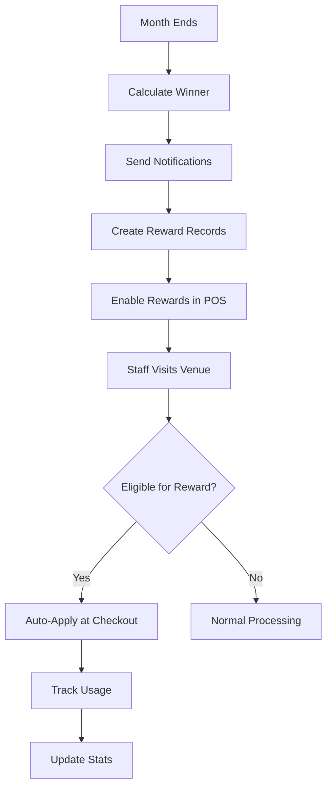

# Industry Love Competition
## Gamified Monthly Competition for Hospitality Workers

---

## Overview

**Industry Love** is a unique gamification feature that creates friendly monthly competitions between neighboring bars and restaurants. Hospitality workers representing their workplace compete to show the most "love" to HOST venues, earning tangible rewards for their entire team.

**Key Differentiator**: This feature transforms industry staff from casual customers into brand ambassadors, creating viral growth and community engagement that no traditional POS system offers.

---

## Problem Statement

### Industry Pain Points
1. **Fragmented Community**: Hospitality workers rarely have platforms connecting them across venues
2. **Limited Staff Perks**: Industry workers often lack recognition or rewards for supporting peers
3. **Competitive Isolation**: Venues operate in silos without healthy competition
4. **Customer Acquisition Costs**: Traditional marketing is expensive and impersonal

### Our Solution
Create a visit-based (not spend-based) monthly competition where industry staff:
- Represent their workplace on the Guest app
- Earn points for their team with each venue visit
- Compete for team-wide rewards
- Build authentic community connections

**Result**: Viral growth, consistent traffic, and genuine brand advocacy.

---

## Core Mechanics

### Competition Structure

```
Month: October 2025
HOST Venue: "The Bourbon Room"
Geographic Radius: 5 miles

Competing Teams:
1. The Oak Barrel (23 visits) 🥇
2. Bourbon & Rye (19 visits) 🥈
3. Craft & Draft (15 visits) 🥉
4. Pour Decisions (12 visits)
5. Last Call (8 visits)

Winner Reward: 20% off all tabs in November
Runner-up Reward: Free appetizer per visit
Third Place: Priority reservations
```

### Scoring System

**Points Allocation:**
- ✅ **1 point per check-in** (regardless of spend amount)
- ✅ Visit verified by QR code scan or geofence check-in
- ✅ One visit per day per staff member counts
- ✅ All verified staff from a venue contribute to team total

**Why Visit-Based (Not Spend-Based)?**
- **Fairness**: Equal opportunity regardless of income level
- **Inclusivity**: Bartenders, servers, cooks all contribute equally
- **Authenticity**: Measures genuine support, not just big spenders
- **Simplicity**: Easy to understand and track

### Eligibility Requirements

**For Participants (Industry Staff):**
- Must be verified hospitality industry employee
- Must attach workplace to Guest profile
- Workplace must be bar/restaurant/hotel (not HOST client venue)
- One workplace affiliation per account
- Can change affiliation once every 3 months

**For Venues to Compete:**
- Must have 3+ verified staff members registered
- Must be within geographic radius (default 5 miles)
- Must be active in current competition month
- Automatically included if criteria met

**For HOST Venues to Offer Competition:**
- Any venue using HOST POS can enable
- Venue configures reward structure
- Venue sets geographic radius
- Competition runs automatically each month

---

## User Experience

### For Industry Staff (Guest App)

#### Phase 1: Registration & Verification

**Profile Setup Flow:**
```
1. Open Guest app → Profile
2. Tap "Industry Perks" (new section)
3. Toggle "I work in hospitality"
4. Enter workplace details:
   - Venue name: "The Oak Barrel"
   - Address: "123 Main St, Austin, TX"
   - Position: "Bartender"
5. Upload verification:
   - Option A: Photo of paystub
   - Option B: Business card
   - Option C: LinkedIn profile
6. Submit for review
7. Receive approval notification (24-48 hours)
```

**Verification Badge:**
Once approved, profile shows:
- 🍺 "Representing The Oak Barrel"
- Industry Member badge
- Team stats visible

#### Phase 2: Competition Participation

**Check-In Experience:**
```
When visiting HOST venue:

1. Scan QR code or use geofence check-in
2. See confirmation: "✅ Visit counted for The Oak Barrel!"
3. View updated team standings
4. Push notification: "You're visit #4 this month!"
```

**Leaderboard Screen:**
```
┌─────────────────────────────────────────────┐
│  🏆 Industry Love Challenge                 │
│  at The Bourbon Room                        │
│  October 2025                               │
│                                             │
│  You're representing:                       │
│  🍺 The Oak Barrel                          │
│                                             │
│  ═════════════════════════════════════════  │
│                                             │
│  🥇  Bourbon & Rye              23 visits   │
│      Sarah K, Mike T, +8 teammates          │
│                                             │
│  🥈  The Oak Barrel             19 visits ⭐│
│      You, Alex M, +6 teammates              │
│      ▸ Need 5 more visits for #1!          │
│                                             │
│  🥉  Craft & Draft              15 visits   │
│      James P, Lisa R, +4 teammates          │
│                                             │
│  4   Pour Decisions             12 visits   │
│  5   Last Call                   8 visits   │
│  6   The Tipsy Crow              5 visits   │
│                                             │
│  ═════════════════════════════════════════  │
│                                             │
│  Your Contributions: 4 visits               │
│  Team Average: 2.7 visits per person        │
│                                             │
│  This Month's Prizes:                       │
│  🥇  20% off all tabs in November          │
│  🥈  Free appetizer per visit              │
│  🥉  Priority reservations                 │
│                                             │
│  ⏰ 8 days remaining                        │
│                                             │
│  [Share with Team] [View Full Stats]       │
└─────────────────────────────────────────────┘
```

**Personal Stats Dashboard:**
```
Your Industry Love Stats

October Performance:
• Total visits: 4
• Team rank: #2 of 6
• Points contributed: 4
• Next visit reminder: Visit again before 10/25!

Team Breakdown:
You:           4 visits  ████████░░ 40%
Alex M:        3 visits  ██████░░░░ 30%
Jamie L:       2 visits  ████░░░░░░ 20%
Others (4):    10 visits ████░░░░░░ 10%

Team Total: 19 visits
```

#### Phase 3: Victory & Rewards

**Winner Announcement (End of Month):**
```
Push Notification:
"🎉 Victory! The Oak Barrel WON October's
Industry Love! All staff enjoy 20% off in November!"

Email Summary:
━━━━━━━━━━━━━━━━━━━━━━━━━━━━━
🏆 You did it! Team Oak Barrel won!
━━━━━━━━━━━━━━━━━━━━━━━━━━━━━

October Recap:
• Final Score: 23 visits
• Your Contribution: 4 visits (17%)
• MVP: Sarah K with 7 visits

November Rewards:
✓ 20% off every tab
✓ Valid all month
✓ Auto-applied at checkout
✓ Stackable with Guest rewards

Share the victory with your team!
[Post to Social] [View Certificate]
```

**Using Rewards (Winner's Digital Card):**
```
┌─────────────────────────────────────────┐
│  Sarah Thompson                         │
│  ⭐ Guest Member                        │
│  🍺 The Oak Barrel - Industry Winner    │
│                                         │
│  Active Rewards:                        │
│  🏆 Industry Love Winner (Nov 2025)    │
│     20% off all purchases               │
│     Used: 2 times                       │
│                                         │
│  Points Balance: 2,450                  │
│                                         │
│  [View Details] [Share Badge]           │
└─────────────────────────────────────────┘
```

---

### For Venue Managers (HOST POS)

#### Dashboard: Industry Love Management

**Competition Setup Screen:**
```
┌─────────────────────────────────────────────────┐
│  Industry Love Competition                      │
│  Monthly Team Challenge                         │
│                                                 │
│  Status: ✅ Active (October 2025)              │
│                                                 │
│  Configuration                                  │
│  ─────────────────────────────────────────────  │
│                                                 │
│  Geographic Radius:     [5 miles     ▼]        │
│  Min Team Size:         [3 members   ▼]        │
│                                                 │
│  Reward Structure:                              │
│  🥇 Winner:                                     │
│     [Percentage Discount ▼] [20%]              │
│     Description: "20% off all tabs"             │
│                                                 │
│  🥈 Runner-Up:                                  │
│     [Comp Item ▼] [Free Appetizer]             │
│     Description: "One free app per visit"       │
│                                                 │
│  🥉 Third Place:                                │
│     [Priority Access ▼]                         │
│     Description: "Skip the waitlist"            │
│                                                 │
│  [Save Configuration] [Preview Leaderboard]     │
└─────────────────────────────────────────────────┘
```

**Live Leaderboard View:**
```
Industry Love Leaderboard - October 2025

Rank  Team              Visits  Δ    Active Staff
────────────────────────────────────────────────
🥇 1  Bourbon & Rye       23   ↑2        10
🥈 2  The Oak Barrel      19   ─         7
🥉 3  Craft & Draft       15   ↓1        6
   4  Pour Decisions      12   ↑1        5
   5  Last Call            8   ─         4
   6  The Tipsy Crow       5   NEW       3

Total Participating Staff: 35
Total Visits This Month: 82
Avg Visits per Staff: 2.3

[Export Report] [Notify Leaders] [End Early]
```

**Staff Recognition at Checkout:**

When industry staff member checks in:
```
┌─────────────────────────────────────────┐
│ 👤 Mike Johnson                         │
│ ⭐ Guest Member                         │
│ 🍺 Industry Staff - The Oak Barrel      │
│                                         │
│ 🏆 Industry Love Competition            │
│    Visit #4 this month                  │
│    Team Rank: #2 (19 total visits)     │
│    4 visits behind 1st place            │
│                                         │
│ 💳 Active: Nov Winner Discount (20%)   │
│                                         │
│ Quick Actions:                          │
│ [View Team Stats] [Message Staff]      │
└─────────────────────────────────────────┘
```

**Analytics Dashboard:**
```
Industry Love Impact Report
October 2025

Revenue:
• Industry staff revenue: $8,450
• Average check (industry): $42
• Total transactions: 201
• Incremental revenue: +$3,200 vs baseline

Traffic Patterns:
• Peak industry visits: Tue-Thu 5-7pm
• Off-peak capture: 62% during slow hours
• Repeat visit rate: 78%

Community Growth:
• New industry signups: 12
• Total industry guests: 35
• Venues represented: 6
• Average team size: 5.8 staff

Competition Engagement:
• Participation rate: 89%
• Social shares: 47
• Referrals generated: 8
• Special Guest conversions: 4 (11%)

[Export Full Report] [Compare to Last Month]
```

---

## Technical Implementation

### Database Schema

```typescript
// Add to GuestProfile
interface GuestProfile {
  // ... existing fields

  industryAffiliation?: {
    // Workplace Info
    venueName: string;
    venueAddress: string;
    venueType: 'bar' | 'restaurant' | 'hotel' | 'nightclub' | 'catering' | 'other';
    venueId?: string; // If venue also uses HOST

    // Staff Info
    position: string; // bartender, server, manager, chef, sommelier, etc.
    employmentStartDate?: Date;

    // Verification
    verificationStatus: 'pending' | 'verified' | 'rejected';
    verificationMethod: 'paystub' | 'business_card' | 'linkedin' | 'email_domain' | 'manual';
    verificationDocuments: string[]; // URLs to uploaded docs
    verifiedAt?: Date;
    verifiedBy?: string; // Admin user ID
    rejectionReason?: string;

    // Affiliation Management
    affiliatedSince: Date;
    lastAffiliationChange?: Date;
    affiliationChangeCount: number;

    // Privacy
    showOnLeaderboard: boolean;
    allowTeamContact: boolean;
  };

  // Competition Stats
  industryCompetitionStats?: {
    totalCompetitionsEntered: number;
    competitionsWon: number;
    totalVisitsContributed: number;
    averageVisitsPerMonth: number;
    currentMonthVisits: number;
    lastVisitDate?: Date;
  };
}

// Industry Competition
interface IndustryCompetition {
  id: string;
  hostVenueId: string;
  venueName: string;

  // Competition Period
  month: string; // '2025-10'
  year: number;
  startDate: Date;
  endDate: Date;

  // Configuration
  config: {
    geographicRadius: number; // miles
    minTeamSize: number; // minimum staff to compete
    maxTeamsDisplayed: number; // leaderboard display limit
    pointsPerVisit: number; // usually 1
    maxVisitsPerDay: number; // usually 1
    allowSameVenueStaff: boolean; // if venue has multiple locations
  };

  // Participating Teams
  teams: {
    venueId: string; // unique identifier for competing venue
    venueName: string;
    venueAddress: string;
    venueType: string;

    // Team Stats
    memberCount: number;
    activeMembers: number; // visited at least once
    totalVisits: number;
    rank: number;
    previousRank?: number;

    // Members
    members: {
      guestId: string;
      guestName: string;
      position: string;
      visitsThisMonth: number;
      lastVisit?: Date;
    }[];

    // Performance
    averageVisitsPerMember: number;
    firstVisitDate: Date;
    lastVisitDate: Date;

    // Status
    isEligible: boolean; // meets min team size
    inactiveDays: number;
  }[];

  // Visit Tracking
  visits: {
    id: string;
    guestId: string;
    guestName: string;
    guestVenueAffiliation: string;
    orderId?: string;
    checkInTime: Date;
    pointsEarned: number;
    verificationMethod: 'qr_code' | 'geofence' | 'manual';
    validatedAt: Date;
  }[];

  // Winner Information
  winner?: {
    venueId: string;
    venueName: string;
    totalVisits: number;
    memberCount: number;
    announcedAt: Date;
    rewardsAppliedAt?: Date;
  };

  runnerUp?: {
    venueId: string;
    venueName: string;
    totalVisits: number;
  };

  thirdPlace?: {
    venueId: string;
    venueName: string;
    totalVisits: number;
  };

  // Reward Structure
  rewards: {
    placement: 'winner' | 'runner_up' | 'third_place';
    type: 'percentage_discount' | 'comp_item' | 'priority_access' | 'special_guest_trial' | 'custom';
    value: string; // '20%', 'Free Appetizer', etc.
    description: string;
    validityPeriod: {
      start: Date;
      end: Date;
    };
    usageLimit?: number; // per person, null = unlimited
    stackable: boolean; // can combine with other rewards
  }[];

  // Status & Metadata
  status: 'pending' | 'active' | 'completed' | 'cancelled';

  // Analytics
  analytics: {
    totalRevenue: number;
    totalTransactions: number;
    averageCheckSize: number;
    incrementalRevenue: number;
    newIndustrySignups: number;
    socialShares: number;
    specialGuestConversions: number;
  };

  createdAt: Date;
  updatedAt: Date;
}

// Industry Visit Record
interface IndustryVisit {
  id: string;
  competitionId: string;

  // Guest Info
  guestId: string;
  guestProfile: {
    name: string;
    email: string;
    venueAffiliation: string;
    position: string;
  };

  // Visit Details
  hostVenueId: string;
  orderId?: string;
  checkInTime: Date;
  checkOutTime?: Date;

  // Scoring
  pointsAwarded: number;
  validForCompetition: boolean;
  invalidReason?: string; // 'already_visited_today', 'team_not_eligible', etc.

  // Verification
  verificationMethod: 'qr_code' | 'geofence' | 'nfc' | 'manual';
  verificationData?: {
    qrCodeId?: string;
    geofenceAccuracy?: number;
    manuallyVerifiedBy?: string;
  };
  validatedAt: Date;

  // Order Details (optional)
  orderTotal?: number;
  orderItems?: number;

  createdAt: Date;
}

// Industry Reward Redemption
interface IndustryRewardRedemption {
  id: string;
  competitionId: string;
  guestId: string;

  // Reward Details
  rewardType: string;
  rewardValue: string;
  rewardDescription: string;

  // Redemption
  redeemedAt: Date;
  orderId: string;
  orderTotal: number;
  discountApplied: number;

  // Validation
  validFrom: Date;
  validUntil: Date;
  usageCount: number;
  maxUsage?: number;

  createdAt: Date;
}
```

### API Endpoints

```typescript
// ============================================
// INDUSTRY AFFILIATION MANAGEMENT
// ============================================

// Register industry affiliation
POST /api/guest/industry/register-affiliation
Request: {
  venueName: string;
  venueAddress: string;
  venueType: string;
  position: string;
  verificationMethod: 'paystub' | 'business_card' | 'linkedin' | 'email_domain';
  documents?: File[];
}
Response: {
  affiliationId: string;
  status: 'pending' | 'verified';
  estimatedReviewTime: string;
}

// Get affiliation status
GET /api/guest/industry/affiliation-status
Response: {
  status: 'pending' | 'verified' | 'rejected' | 'none';
  affiliation?: IndustryAffiliation;
  canChange: boolean;
  nextChangeDate?: Date;
}

// Update affiliation (limited to once per 3 months)
PATCH /api/guest/industry/update-affiliation
Request: {
  venueName: string;
  venueAddress: string;
  position: string;
  reason: string;
}
Response: {
  success: boolean;
  newAffiliation: IndustryAffiliation;
}

// Upload additional verification
POST /api/guest/industry/upload-verification
Request: FormData with files
Response: {
  documentsUploaded: number;
  status: 'under_review';
}


// ============================================
// COMPETITION PARTICIPATION (Guest Side)
// ============================================

// Get current competition for venue
GET /api/guest/industry/competition/current/:venueId
Response: {
  competition: IndustryCompetition;
  myTeam?: TeamStats;
  myRank?: number;
  myVisitsThisMonth: number;
}

// Get leaderboard
GET /api/guest/industry/competition/:competitionId/leaderboard
Query: { limit?: number; offset?: number }
Response: {
  competition: {
    month: string;
    hostVenue: string;
    daysRemaining: number;
  };
  myTeam: {
    rank: number;
    totalVisits: number;
    memberCount: number;
    pointsBehindLeader: number;
  };
  leaderboard: TeamStanding[];
  totalTeams: number;
}

// Get my team stats
GET /api/guest/industry/my-team-stats
Query: { competitionId?: string }
Response: {
  team: {
    venueName: string;
    memberCount: number;
    totalVisits: number;
    rank: number;
  };
  myContribution: {
    visitsThisMonth: number;
    percentOfTeam: number;
    lastVisit?: Date;
  };
  teammates: {
    name: string;
    position: string;
    visits: number;
  }[];
}

// Get my competition history
GET /api/guest/industry/my-competitions
Query: { limit?: number; status?: 'won' | 'participated' }
Response: {
  competitions: {
    month: string;
    hostVenue: string;
    teamRank: number;
    myVisits: number;
    outcome: 'won' | 'runner_up' | 'third_place' | 'participated';
    rewardsEarned?: Reward[];
  }[];
  stats: {
    totalCompetitions: number;
    competitionsWon: number;
    totalVisits: number;
    averageVisitsPerMonth: number;
  };
}

// Record visit (automated via check-in)
POST /api/industry-competition/:competitionId/record-visit
Request: {
  guestId: string;
  checkInMethod: 'qr_code' | 'geofence';
  checkInData?: any;
}
Response: {
  visitRecorded: boolean;
  pointsAwarded: number;
  teamNewTotal: number;
  teamRank: number;
  message: string; // "Visit #4 counted for The Oak Barrel!"
}


// ============================================
// COMPETITION MANAGEMENT (Venue Side)
// ============================================

// Get venue's current competition
GET /api/venue/:venueId/industry-competition/current
Response: {
  competition: IndustryCompetition;
  analytics: CompetitionAnalytics;
}

// Create new competition for month
POST /api/venue/:venueId/industry-competition/create
Request: {
  month: string; // '2025-11'
  config: {
    geographicRadius: number;
    minTeamSize: number;
  };
  rewards: Reward[];
}
Response: {
  competition: IndustryCompetition;
  estimatedParticipants: number;
}

// Update competition configuration
PATCH /api/venue/:venueId/industry-competition/:competitionId/configure
Request: {
  config?: CompetitionConfig;
  rewards?: Reward[];
}
Response: {
  competition: IndustryCompetition;
  changesApplied: string[];
}

// Get competition leaderboard (venue view)
GET /api/venue/:venueId/industry-competition/:competitionId/leaderboard
Response: {
  leaderboard: TeamStanding[];
  detailedStats: {
    totalVisits: number;
    activeParticipants: number;
    revenueGenerated: number;
    averageCheckSize: number;
  };
}

// Get competition history
GET /api/venue/:venueId/industry-competition/history
Query: { limit?: number; year?: number }
Response: {
  competitions: CompetitionSummary[];
  aggregateStats: {
    totalCompetitions: number;
    totalParticipants: number;
    totalRevenue: number;
    averageTeams: number;
  };
}

// Get analytics
GET /api/venue/:venueId/industry-competition/:competitionId/analytics
Response: {
  revenue: RevenueAnalytics;
  traffic: TrafficAnalytics;
  engagement: EngagementAnalytics;
  demographics: DemographicAnalytics;
}

// End competition early
POST /api/venue/:venueId/industry-competition/:competitionId/end
Request: { reason: string }
Response: {
  competition: IndustryCompetition;
  winner: TeamStanding;
  notificationsSent: number;
}


// ============================================
// ADMIN / VERIFICATION
// ============================================

// Get pending verifications
GET /api/admin/industry-affiliation/pending
Query: { limit?: number; offset?: number }
Response: {
  pending: {
    guestId: string;
    guestName: string;
    guestEmail: string;
    venueName: string;
    position: string;
    submittedAt: Date;
    documents: string[];
  }[];
  total: number;
}

// Verify affiliation
POST /api/admin/industry-affiliation/:affiliationId/verify
Request: {
  verifiedBy: string;
  notes?: string;
}
Response: {
  success: boolean;
  guest: GuestProfile;
  notificationSent: boolean;
}

// Reject affiliation
POST /api/admin/industry-affiliation/:affiliationId/reject
Request: {
  rejectedBy: string;
  reason: string;
}
Response: {
  success: boolean;
  notificationSent: boolean;
}

// Get competition analytics (platform-wide)
GET /api/admin/industry-competition/analytics
Query: {
  startDate?: Date;
  endDate?: Date;
  venueId?: string;
}
Response: {
  totalCompetitions: number;
  totalParticipants: number;
  totalRevenue: number;
  averageTeamSize: number;
  engagementRate: number;
  topVenues: VenueStats[];
  topTeams: TeamStats[];
}
```

---

## Reward System

### Reward Types

#### 1. Percentage Discount
```typescript
{
  type: 'percentage_discount',
  value: '20%',
  description: '20% off entire tab',
  validityPeriod: {
    start: '2025-11-01',
    end: '2025-11-30'
  },
  usageLimit: null, // unlimited uses
  stackable: true, // can combine with Guest rewards
  applyTo: ['food', 'drinks', 'both'],
  excludes: ['alcohol_allocations', 'special_events']
}
```

**POS Application:**
- Auto-applied at checkout
- Shows as "Industry Winner Discount (20%)"
- Calculated after items, before tax
- Can set exclusions (e.g., already discounted items)

#### 2. Complimentary Items
```typescript
{
  type: 'comp_item',
  value: 'Free Appetizer',
  description: 'Choose any appetizer up to $15',
  validityPeriod: {
    start: '2025-11-01',
    end: '2025-11-30'
  },
  usageLimit: 1, // once per visit
  itemCategory: 'appetizers',
  maxValue: 15.00,
  menuItems: ['wings', 'nachos', 'calamari', 'bruschetta']
}
```

**POS Application:**
- Staff selects eligible item
- Applies discount of 100% up to max value
- If item exceeds max value, charges difference
- Tracks redemption per visit

#### 3. Priority Access
```typescript
{
  type: 'priority_access',
  value: 'Skip Waitlist',
  description: 'Priority seating and reservations',
  validityPeriod: {
    start: '2025-11-01',
    end: '2025-11-30'
  },
  benefits: [
    'Skip waitlist',
    'Book reservations 30 days out',
    'Preferred seating',
    'Last-minute booking priority'
  ]
}
```

**System Application:**
- Reservation system automatically prioritizes
- Host/hostess sees "Industry Winner" flag
- Bypass normal waitlist queue

#### 4. Special Guest Trial
```typescript
{
  type: 'special_guest_trial',
  value: '1 Month Free',
  description: 'Free Special Guest membership for November',
  validityPeriod: {
    start: '2025-11-01',
    end: '2025-11-30'
  },
  benefits: [
    'All Special Guest perks',
    'Allocation access',
    '2x points',
    'Extended happy hour'
  ],
  autoRenew: false
}
```

**System Application:**
- Temporary Special Guest status
- All premium features enabled
- Promotional entry to convert to paid
- Expires automatically at end of period

### Reward Application Flow



---

## Business Benefits

### For HOST Venues

**Revenue Impact:**
- **Incremental Traffic**: $500-1,000/month from industry staff
- **Off-Peak Optimization**: 60% of visits during slower periods
- **Higher Frequency**: Industry staff visit 2.5x/month vs 1.2x general public
- **Authentic Marketing**: Staff recommend to customers (+15-20% referrals)

**Community Building:**
- Position as "industry hangout"
- Attract high-quality staff from competitors
- Build relationships with key influencers
- Create word-of-mouth marketing machine

**Competitive Intelligence:**
- Understand competitor landscape
- Track staff movement between venues
- Identify trending concepts
- Gather insider feedback

**Marketing ROI:**
- **Cost**: Rewards (15-20% of industry revenue)
- **Benefit**: Viral growth + authentic advocacy
- **CAC Reduction**: 40% lower than traditional marketing
- **LTV Increase**: Industry staff convert to Special Guest at 25% rate

### For Industry Staff

**Financial Value:**
- Average savings: $100-200/month for active participants
- Access to premium experiences at discount
- Team-building and camaraderie
- Professional networking opportunities

**Recognition:**
- Acknowledged as industry insider
- VIP treatment at participating venues
- Social proof and status
- Achievement badges and history

**Fair Competition:**
- Visit-based (not wealth-based)
- Equal opportunity for all positions
- Team effort (not individual)
- Fun and engaging

### For HOST Platform

**Network Effects:**
- Each venue attracts staff from 5-8 competitors
- Staff recruit colleagues (1.5x viral coefficient)
- Competing venues eventually adopt HOST
- Geographic market penetration

**Premium Conversions:**
- 25% of active industry members upgrade to Special Guest
- Higher LTV than general Guests
- Stronger retention (community lock-in)
- Ambassador program pipeline

**Market Intelligence:**
- Real-time competitive landscape mapping
- Staff migration patterns
- Venue popularity trends
- Market expansion opportunities

**Differentiation:**
- Unique feature no competitor offers
- Community-driven (not just transactional)
- Viral growth mechanism
- Industry-specific value proposition

---

## Success Metrics

### Adoption Metrics

**Target (Year 1):**
- 40% of HOST venues enable Industry Love
- 500+ verified industry staff across platform
- 60 active competitions per month
- 8 competing venues per location (average)

**Engagement:**
- 70% of verified staff participate monthly
- 2.5 visits per staff per month (average)
- 80% month-over-month retention
- 50+ social media posts per month

### Business Metrics

**Revenue:**
- $8,000-15,000 incremental annual revenue per venue
- 15-20% of revenue during off-peak hours
- 25% conversion to Special Guest membership
- $30-50 average check size (industry staff)

**Growth:**
- 1.5x viral coefficient (staff recruit colleagues)
- 30% of industry staff refer non-industry friends
- 20% of competing venues eventually adopt HOST
- 10-15 new industry signups per venue per month

### Community Metrics

**Engagement:**
- NPS >70 from industry participants
- 4.5+ star ratings on competition experience
- 80% "would recommend" to colleagues
- 60% participate in 6+ consecutive months

**Social Proof:**
- 50+ user-generated posts per venue per month
- 500+ impressions per social post
- 15-20% share rate on victories
- 10-15 press mentions per quarter

---

## Rollout Plan

### Phase 1: Beta (Month 7 of v0.3)
**Goal**: Validate concept with 5-10 beta venues

**Features:**
- Industry affiliation registration
- Manual verification process
- Basic competition engine
- Simple leaderboard
- Winner discount only

**Success Criteria:**
- 50+ verified industry staff
- 80% participation rate
- 4.0+ satisfaction rating
- Positive revenue impact

### Phase 2: Launch (Month 8 of v0.3)
**Goal**: Full rollout to all venues

**Features:**
- Automated verification (LinkedIn, email domain)
- Full reward system (discounts, comps, access)
- Mobile app integration
- Real-time leaderboards
- Social sharing

**Marketing:**
- Industry influencer partnerships
- Local press outreach
- Social media campaign
- Staff ambassador program

### Phase 3: Scale (Month 9 of v0.3)
**Goal**: Optimize and expand

**Features:**
- Advanced analytics
- Custom reward builder
- Multi-venue competitions
- Tournament mode (quarterly)
- Gamification enhancements

**Optimization:**
- A/B test reward structures
- Refine scoring mechanics
- Improve verification speed
- Expand reward options

---

## Risk Mitigation

### Potential Risks

**1. Verification Fraud**
- **Risk**: Fake industry affiliations
- **Mitigation**:
  - Multi-factor verification (document + email + LinkedIn)
  - Random audits
  - Penalty system (ban for fraud)
  - Employer verification option

**2. Gaming the System**
- **Risk**: Staff visit without spending, just check-in
- **Mitigation**:
  - Require minimum order ($10)
  - POS validation required
  - Staff can flag suspicious activity
  - Pattern detection algorithms

**3. Reward Abuse**
- **Risk**: Excessive use of discounts
- **Mitigation**:
  - Set reasonable limits (20-25% max discount)
  - Usage limits per visit
  - Monthly caps on reward value
  - Venue can adjust anytime

**4. Low Participation**
- **Risk**: Not enough teams to make it interesting
- **Mitigation**:
  - Start with minimum 3 teams
  - Seed with venue's industry connections
  - Offer signup bonuses
  - Launch marketing campaign

**5. Venue Hesitation**
- **Risk**: Venues fear giving away too much
- **Mitigation**:
  - Show ROI calculator
  - Start with conservative rewards
  - Provide opt-out anytime
  - Share success stories

---

## Competitive Analysis

### Competitors Without This Feature
- **Toast**: Traditional loyalty, no industry-specific
- **Square**: Generic rewards, no competition element
- **Clover**: Points-based only, no gamification
- **Lightspeed**: Basic loyalty, no community features

### Our Advantages
✅ **Only POS with industry-specific gamification**
✅ **Visit-based (not spend) = more inclusive**
✅ **Team competition = viral growth**
✅ **Community building = long-term stickiness**
✅ **Authentic brand advocacy = lower CAC**

---

## Future Enhancements (Post-v0.3)

### v0.4+ Ideas
- **Quarterly Tournaments**: City-wide championships
- **Industry Awards**: "Best Bartender Support" etc.
- **Celebrity Judges**: Industry influencers pick bonus winners
- **Charity Component**: Winning team chooses charity donation
- **Multi-City Competitions**: Austin vs Portland vs Denver
- **Industry Showcase**: Winners featured in trade publications
- **Reciprocal Benefits**: Winning venue offers perks at their location

---

## Conclusion

**Industry Love** transforms the Guest rewards system from a customer loyalty program into a community-building platform that:

🎯 **Differentiates HOST** from every competitor
🎯 **Drives viral growth** through authentic advocacy
🎯 **Creates sustainable revenue** through repeat visits
🎯 **Builds lasting community** among hospitality professionals
🎯 **Generates market intelligence** about competitive landscape

This feature alone could become a key selling point that attracts venues to HOST, positioning us as the platform that truly understands and serves the hospitality industry—not just as vendors, but as community partners.

---

*Last Updated: 2025-09-29*
*Version: 1.0.0*
*Status: Specification Complete - Ready for v0.3 Development*