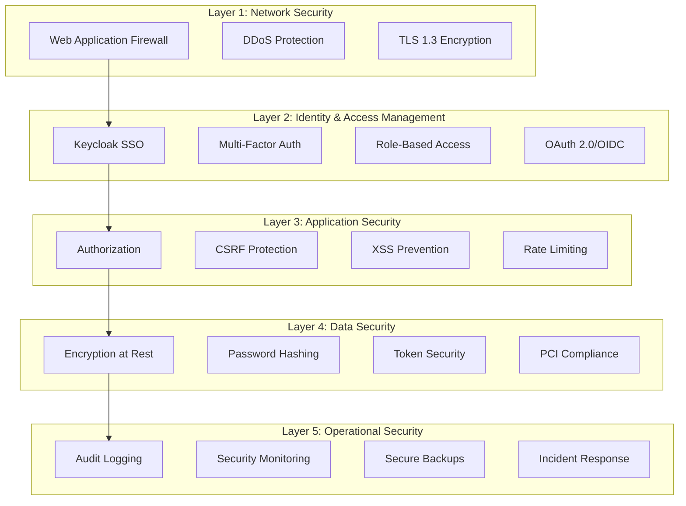
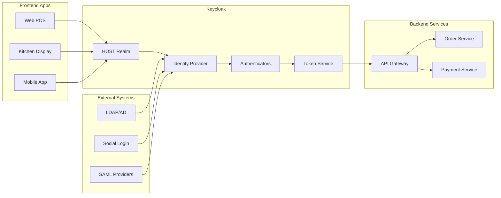
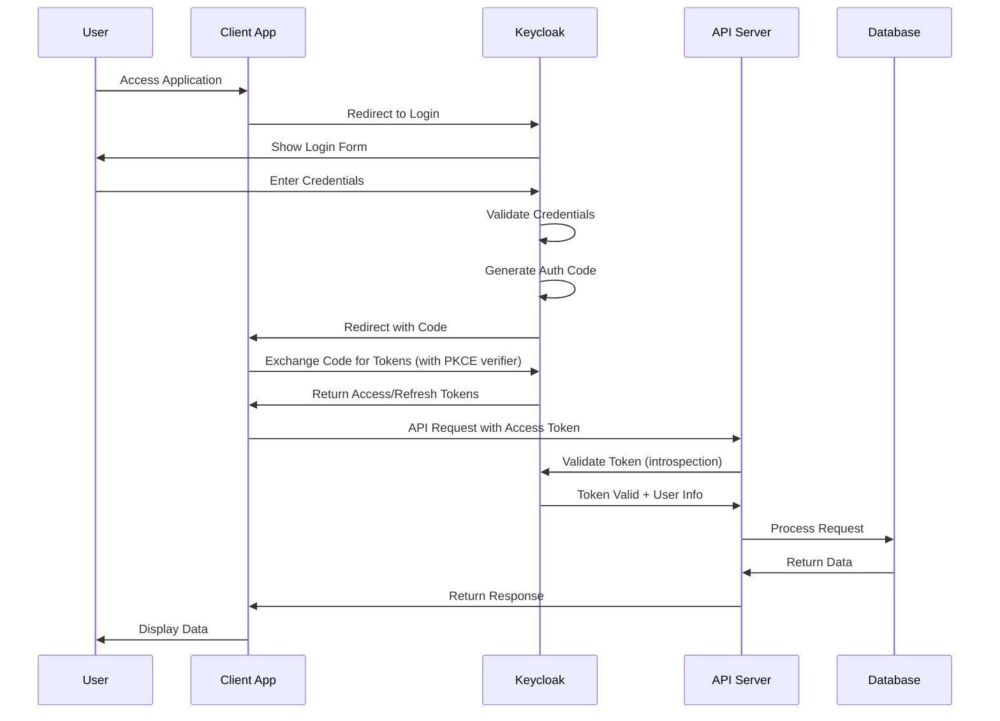
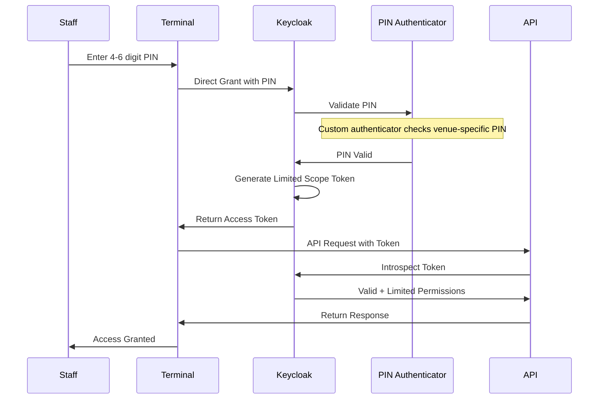
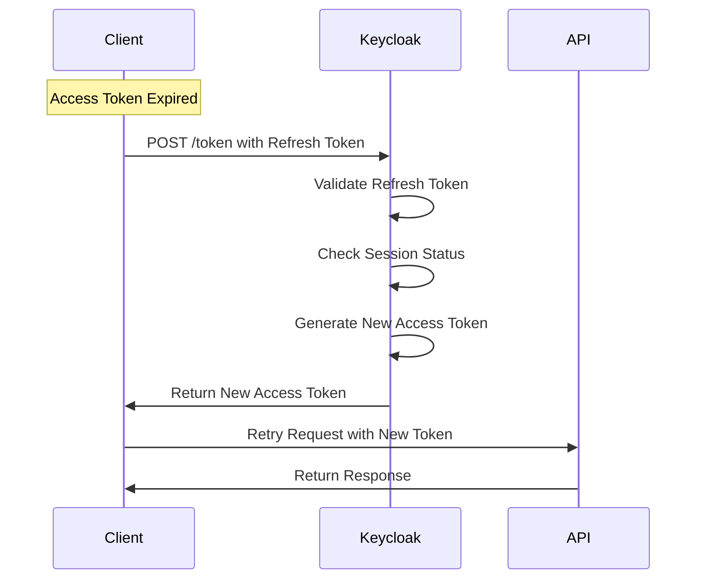

# HOST Security & Authentication Documentation
## Comprehensive Security Architecture with Keycloak

---

## Security Overview

### Defense in Depth Strategy


---

## Keycloak Identity Management

### Why Keycloak?
- **Open Source**: Enterprise-grade identity management without licensing costs
- **Production Ready**: Used by major enterprises globally
- **Standards Compliant**: Full support for OAuth 2.0, OpenID Connect, SAML 2.0
- **Feature Rich**: Built-in MFA, user federation, social login, and fine-grained authorization
- **Scalable**: Clustered deployment support for high availability
- **Extensible**: Custom authenticators, protocols, and storage providers

### Keycloak Architecture


---

## Authentication Flows

### 1. Standard Login Flow (Authorization Code with PKCE)


### 2. PIN Authentication (Custom Keycloak Authenticator)


### 3. Token Refresh Flow


---

## Keycloak Configuration

### Realm Settings
```typescript
// keycloak/realm-config.ts
export const HOST_REALM_CONFIG = {
  realm: "host-pos",
  enabled: true,
  sslRequired: "external",
  registrationAllowed: false,
  registrationEmailAsUsername: true,
  rememberMe: true,
  verifyEmail: true,
  loginWithEmailAllowed: true,
  duplicateEmailsAllowed: false,
  resetPasswordAllowed: true,
  editUsernameAllowed: false,
  bruteForceProtected: true,
  permanentLockout: false,
  maxFailureWaitSeconds: 900, // 15 minutes
  minimumQuickLoginWaitSeconds: 60,
  waitIncrementSeconds: 60,
  quickLoginCheckMilliSeconds: 1000,
  maxDeltaTimeSeconds: 43200, // 12 hours
  failureFactor: 5,
  defaultSignatureAlgorithm: "RS256",
  offlineSessionMaxLifespanEnabled: true,
  offlineSessionMaxLifespan: 2592000, // 30 days

  // Session settings
  ssoSessionIdleTimeout: 28800, // 8 hours
  ssoSessionMaxLifespan: 36000, // 10 hours
  ssoSessionIdleTimeoutRememberMe: 2592000, // 30 days
  ssoSessionMaxLifespanRememberMe: 2592000,

  // Token settings
  accessTokenLifespan: 900, // 15 minutes
  accessTokenLifespanForImplicitFlow: 900,
  accessCodeLifespan: 60,
  accessCodeLifespanUserAction: 300,
  accessCodeLifespanLogin: 1800,
  actionTokenGeneratedByAdminLifespan: 43200,
  actionTokenGeneratedByUserLifespan: 300,

  // Password policy
  passwordPolicy: "length(8) and upperCase(1) and lowerCase(1) and digits(1) and specialChars(1) and notUsername() and notEmail() and hashIterations(210000) and passwordHistory(3)",

  // OTP Policy
  otpPolicyType: "totp",
  otpPolicyAlgorithm: "HmacSHA256",
  otpPolicyInitialCounter: 0,
  otpPolicyDigits: 6,
  otpPolicyLookAheadWindow: 1,
  otpPolicyPeriod: 30,

  // WebAuthn Policy (for hardware keys)
  webAuthnPolicyRpEntityName: "HOST POS",
  webAuthnPolicySignatureAlgorithms: ["ES256", "RS256"],
  webAuthnPolicyRpId: "",
  webAuthnPolicyAttestationConveyancePreference: "indirect",
  webAuthnPolicyAuthenticatorAttachment: "platform",
  webAuthnPolicyRequireResidentKey: "not specified",
  webAuthnPolicyUserVerificationRequirement: "preferred",
  webAuthnPolicyCreateTimeout: 0,
  webAuthnPolicyAvoidSameAuthenticatorRegister: false,

  // Events
  eventsEnabled: true,
  eventsExpiration: 604800, // 7 days
  eventsListeners: ["jboss-logging", "audit-logging"],
  enabledEventTypes: [
    "LOGIN", "LOGIN_ERROR", "LOGOUT",
    "REGISTER", "REGISTER_ERROR",
    "CODE_TO_TOKEN", "CODE_TO_TOKEN_ERROR",
    "REFRESH_TOKEN", "REFRESH_TOKEN_ERROR",
    "INTROSPECT_TOKEN", "INTROSPECT_TOKEN_ERROR",
    "FEDERATED_IDENTITY_LINK", "FEDERATED_IDENTITY_LINK_ERROR",
    "UPDATE_PASSWORD", "UPDATE_PASSWORD_ERROR",
    "RESET_PASSWORD", "RESET_PASSWORD_ERROR",
    "CLIENT_LOGIN", "CLIENT_LOGIN_ERROR"
  ],
  adminEventsEnabled: true,
  adminEventsDetailsEnabled: true
};
```

### Client Configuration
```typescript
// keycloak/client-config.ts
export const POS_CLIENT_CONFIG = {
  clientId: "host-pos-web",
  name: "HOST POS Web Application",
  description: "Main POS terminal application",
  rootUrl: "${VITE_APP_URL}",
  adminUrl: "${VITE_APP_URL}",
  baseUrl: "/",
  surrogateAuthRequired: false,
  enabled: true,
  alwaysDisplayInConsole: false,
  clientAuthenticatorType: "client-secret",
  redirectUris: [
    "${VITE_APP_URL}/*"
  ],
  webOrigins: [
    "${VITE_APP_URL}"
  ],
  notBefore: 0,
  bearerOnly: false,
  consentRequired: false,
  standardFlowEnabled: true,
  implicitFlowEnabled: false,
  directAccessGrantsEnabled: true, // For PIN authentication
  serviceAccountsEnabled: false,
  publicClient: true,
  frontchannelLogout: true,
  protocol: "openid-connect",
  attributes: {
    "pkce.code.challenge.method": "S256",
    "use.refresh.tokens": "true",
    "access.token.lifespan": "900",
    "client.session.idle.timeout": "28800",
    "client.session.max.lifespan": "36000"
  },
  authenticationFlowBindingOverrides: {},
  fullScopeAllowed: false,
  nodeReRegistrationTimeout: -1,
  defaultClientScopes: [
    "web-origins", "profile", "roles", "email"
  ],
  optionalClientScopes: [
    "address", "phone", "offline_access", "microprofile-jwt"
  ]
};

export const API_CLIENT_CONFIG = {
  clientId: "host-pos-api",
  name: "HOST POS API Service",
  description: "Backend API service client",
  rootUrl: "${API_URL}",
  enabled: true,
  clientAuthenticatorType: "client-secret",
  secret: "${API_CLIENT_SECRET}",
  bearerOnly: true,
  standardFlowEnabled: false,
  implicitFlowEnabled: false,
  directAccessGrantsEnabled: false,
  serviceAccountsEnabled: true,
  publicClient: false,
  protocol: "openid-connect",
  attributes: {
    "use.jwks.url": "true",
    "jwks.url": "${API_URL}/jwks"
  }
};
```

### Custom PIN Authenticator
```java
// keycloak/authenticators/PinAuthenticator.java
package com.host.keycloak.authenticator;

import org.keycloak.authentication.AuthenticationFlowContext;
import org.keycloak.authentication.AuthenticationFlowError;
import org.keycloak.authentication.Authenticator;
import org.keycloak.models.KeycloakSession;
import org.keycloak.models.RealmModel;
import org.keycloak.models.UserModel;
import org.keycloak.models.utils.FormMessage;

public class PinAuthenticator implements Authenticator {

    @Override
    public void authenticate(AuthenticationFlowContext context) {
        String venueId = context.getHttpRequest().getFormParameters().getFirst("venue_id");
        String pin = context.getHttpRequest().getFormParameters().getFirst("pin");

        if (venueId == null || pin == null) {
            context.attempted();
            return;
        }

        UserModel user = getUserByVenuePin(context.getSession(), venueId, pin);

        if (user == null) {
            incrementFailureCount(context, venueId, pin);
            context.failure(AuthenticationFlowError.INVALID_CREDENTIALS);
            return;
        }

        if (isPinLocked(context.getSession(), user)) {
            context.failure(AuthenticationFlowError.USER_TEMPORARILY_DISABLED);
            return;
        }

        // Set limited scope for PIN authentication
        context.getAuthenticationSession().setAuthNote("scope", "pos-basic");
        context.getAuthenticationSession().setAuthNote("auth_method", "pin");
        context.getAuthenticationSession().setAuthNote("venue_id", venueId);

        resetFailureCount(context, user);
        context.setUser(user);
        context.success();
    }

    private UserModel getUserByVenuePin(KeycloakSession session, String venueId, String pin) {
        // Query user by venue-specific PIN attribute
        return session.users()
            .searchForUserByUserAttribute("venue_pin_" + venueId, hashPin(pin), session.getContext().getRealm())
            .stream()
            .findFirst()
            .orElse(null);
    }

    private boolean isPinLocked(KeycloakSession session, UserModel user) {
        String lockoutTime = user.getFirstAttribute("pin_lockout_until");
        if (lockoutTime != null) {
            long lockoutUntil = Long.parseLong(lockoutTime);
            if (System.currentTimeMillis() < lockoutUntil) {
                return true;
            } else {
                // Clear lockout
                user.removeAttribute("pin_lockout_until");
                user.removeAttribute("pin_failure_count");
            }
        }
        return false;
    }

    private void incrementFailureCount(AuthenticationFlowContext context, String venueId, String pin) {
        // Track failures by venue and implement lockout after 3 attempts
        // This would interact with a cache or database to track attempts
    }

    private void resetFailureCount(AuthenticationFlowContext context, UserModel user) {
        user.removeAttribute("pin_failure_count");
        user.removeAttribute("pin_lockout_until");
    }

    private String hashPin(String pin) {
        // Use BCrypt or similar for PIN hashing
        return BCrypt.hashpw(pin, BCrypt.gensalt(10));
    }

    @Override
    public boolean requiresUser() {
        return false;
    }

    @Override
    public boolean configuredFor(KeycloakSession session, RealmModel realm, UserModel user) {
        return user.getFirstAttribute("venue_pin_" + getVenueId(session)) != null;
    }

    @Override
    public void setRequiredActions(KeycloakSession session, RealmModel realm, UserModel user) {
        // No required actions for PIN auth
    }
}
```

---

## Node.js Integration

### Keycloak Adapter Setup
```typescript
// packages/auth/keycloak.config.ts
import Keycloak from 'keycloak-connect';
import session from 'express-session';
import { Redis } from 'ioredis';
import RedisStore from 'connect-redis';

// Redis store for sessions
const redis = new Redis({
  host: process.env.REDIS_HOST,
  port: parseInt(process.env.REDIS_PORT || '6379'),
  password: process.env.REDIS_PASSWORD,
  db: 0,
  keyPrefix: 'session:',
});

// Session configuration
export const sessionConfig = session({
  store: new RedisStore({ client: redis }),
  secret: process.env.SESSION_SECRET!,
  resave: false,
  saveUninitialized: false,
  cookie: {
    secure: process.env.NODE_ENV === 'production',
    httpOnly: true,
    maxAge: 8 * 60 * 60 * 1000, // 8 hours
    sameSite: 'lax'
  }
});

// Keycloak configuration
export const keycloakConfig = {
  realm: process.env.KEYCLOAK_REALM || 'host-pos',
  'auth-server-url': process.env.KEYCLOAK_URL || 'http://localhost:8080/',
  'ssl-required': 'external',
  resource: process.env.KEYCLOAK_CLIENT_ID || 'host-pos-api',
  'bearer-only': true,
  'verify-token-audience': true,
  'use-resource-role-mappings': true,
  'confidential-port': 0,
  credentials: {
    secret: process.env.KEYCLOAK_CLIENT_SECRET
  }
};

export const keycloak = new Keycloak({ store: sessionConfig }, keycloakConfig);
```

### Authentication Middleware
```typescript
// packages/auth/middleware/keycloak.middleware.ts
import { Request, Response, NextFunction } from 'express';
import jwt from 'jsonwebtoken';
import jwksClient from 'jwks-rsa';

// JWKS client for token validation
const jwksClient = jwksClient({
  jwksUri: `${process.env.KEYCLOAK_URL}/realms/${process.env.KEYCLOAK_REALM}/protocol/openid-connect/certs`,
  cache: true,
  cacheMaxEntries: 5,
  cacheMaxAge: 86400000, // 24 hours
  rateLimit: true,
  jwksRequestsPerMinute: 10
});

// Get signing key from Keycloak
function getKey(header: any, callback: any) {
  jwksClient.getSigningKey(header.kid, (err: any, key: any) => {
    if (err) {
      return callback(err);
    }
    const signingKey = key.getPublicKey();
    callback(null, signingKey);
  });
}

// Verify and decode JWT token
export async function verifyToken(token: string): Promise<any> {
  return new Promise((resolve, reject) => {
    jwt.verify(
      token,
      getKey,
      {
        algorithms: ['RS256'],
        issuer: `${process.env.KEYCLOAK_URL}/realms/${process.env.KEYCLOAK_REALM}`,
        audience: process.env.KEYCLOAK_CLIENT_ID
      },
      (err, decoded) => {
        if (err) {
          return reject(err);
        }
        resolve(decoded);
      }
    );
  });
}

// Authentication middleware
export async function authenticate(
  req: Request,
  res: Response,
  next: NextFunction
): Promise<void> {
  try {
    const authHeader = req.headers.authorization;

    if (!authHeader || !authHeader.startsWith('Bearer ')) {
      return res.status(401).json({ error: 'No token provided' });
    }

    const token = authHeader.substring(7);
    const decoded = await verifyToken(token);

    // Attach user info to request
    req.user = {
      id: decoded.sub,
      email: decoded.email,
      name: decoded.name,
      roles: decoded.realm_access?.roles || [],
      venueId: decoded.venue_id,
      permissions: decoded.resource_access?.[process.env.KEYCLOAK_CLIENT_ID]?.roles || []
    };

    // Check if token needs refresh
    const tokenExp = decoded.exp * 1000;
    const now = Date.now();
    const refreshThreshold = 5 * 60 * 1000; // 5 minutes

    if (tokenExp - now < refreshThreshold) {
      res.setHeader('X-Token-Refresh-Required', 'true');
    }

    next();
  } catch (error) {
    console.error('Authentication error:', error);

    if (error.name === 'TokenExpiredError') {
      return res.status(401).json({ error: 'Token expired' });
    }

    if (error.name === 'JsonWebTokenError') {
      return res.status(401).json({ error: 'Invalid token' });
    }

    res.status(500).json({ error: 'Authentication error' });
  }
}

// Authorization middleware
export function authorize(...requiredRoles: string[]) {
  return (req: Request, res: Response, next: NextFunction) => {
    if (!req.user) {
      return res.status(401).json({ error: 'Not authenticated' });
    }

    const userRoles = req.user.roles || [];
    const hasRole = requiredRoles.some(role => userRoles.includes(role));

    if (!hasRole) {
      return res.status(403).json({ error: 'Insufficient permissions' });
    }

    next();
  };
}

// Permission-based authorization
export function requirePermission(...permissions: string[]) {
  return (req: Request, res: Response, next: NextFunction) => {
    if (!req.user) {
      return res.status(401).json({ error: 'Not authenticated' });
    }

    const userPermissions = req.user.permissions || [];
    const hasPermission = permissions.some(perm => userPermissions.includes(perm));

    if (!hasPermission) {
      return res.status(403).json({
        error: 'Missing required permissions',
        required: permissions,
        available: userPermissions
      });
    }

    next();
  };
}

// Venue-specific authorization
export function requireVenueAccess(req: Request, res: Response, next: NextFunction) {
  const requestedVenueId = req.params.venueId || req.body.venueId;
  const userVenueId = req.user?.venueId;

  // Admins can access all venues
  if (req.user?.roles?.includes('admin')) {
    return next();
  }

  if (!requestedVenueId || requestedVenueId !== userVenueId) {
    return res.status(403).json({ error: 'Access denied for this venue' });
  }

  next();
}
```

### Frontend Integration (Svelte 5 + SvelteKit)
```typescript
// apps/web/src/lib/auth/keycloak.ts
import Keycloak from 'keycloak-js';
import { browser } from '$app/environment';

const keycloakConfig = {
  url: import.meta.env.VITE_KEYCLOAK_URL,
  realm: import.meta.env.VITE_KEYCLOAK_REALM,
  clientId: import.meta.env.VITE_KEYCLOAK_CLIENT_ID
};

export const keycloak = browser ? new Keycloak(keycloakConfig) : null;

// Initialize Keycloak
export async function initKeycloak() {
  if (!browser || !keycloak) return false;

  try {
    const authenticated = await keycloak.init({
      onLoad: 'check-sso',
      silentCheckSsoRedirectUri: window.location.origin + '/silent-check-sso.html',
      pkceMethod: 'S256',
      checkLoginIframe: true,
      checkLoginIframeInterval: 30
    });

    if (authenticated) {
      sessionStorage.setItem('keycloak-token', keycloak.token!);

      // Setup token refresh
      setInterval(() => {
        keycloak.updateToken(300).then((refreshed) => {
          if (refreshed) {
            sessionStorage.setItem('keycloak-token', keycloak.token!);
          }
        }).catch(() => {
          keycloak.logout();
        });
      }, 60000);
    }

    return authenticated;
  } catch (error) {
    console.error('Failed to initialize Keycloak', error);
    throw error;
  }
}

// Svelte 5 rune-based auth store
// apps/web/src/lib/stores/auth.svelte.ts
import { keycloak } from '$lib/auth/keycloak';
import type { User } from '$lib/types';

class AuthState {
  isAuthenticated = $state(false);
  isLoading = $state(true);
  user = $state<User | null>(null);
  token = $state<string | null>(null);

  async init() {
    const auth = await initKeycloak();
    this.isAuthenticated = auth;

    if (auth && keycloak?.tokenParsed) {
      this.user = {
        id: keycloak.tokenParsed.sub,
        email: keycloak.tokenParsed.email,
        name: keycloak.tokenParsed.name,
        roles: keycloak.tokenParsed.realm_access?.roles || []
      };
      this.token = keycloak.token || null;
    }

    this.isLoading = false;
  }

  login() {
    keycloak?.login();
  }

  logout() {
    keycloak?.logout();
  }

  register() {
    keycloak?.register();
  }
}

export const authState = new AuthState();
```

```svelte
<!-- apps/web/src/routes/+layout.svelte -->
<script lang="ts">
  import { onMount } from 'svelte';
  import { authState } from '$lib/stores/auth.svelte';

  onMount(() => {
    authState.init();
  });
</script>

{#if authState.isLoading}
  <div>Loading...</div>
{:else if !authState.isAuthenticated}
  <button onclick={() => authState.login()}>Login</button>
{:else}
  <slot />
{/if}
```

```typescript
// apps/web/src/hooks.client.ts - API interceptor for SvelteKit
import { keycloak } from '$lib/auth/keycloak';

export async function handleFetch({ request, fetch }) {
  const token = keycloak?.token;

  if (token) {
    request.headers.set('Authorization', `Bearer ${token}`);
  }

  const response = await fetch(request);

  // Handle token refresh
  if (response.headers.get('x-token-refresh-required')) {
    await keycloak?.updateToken(300);
  }

  // Handle 401 errors
  if (response.status === 401 && keycloak) {
    try {
      await keycloak.updateToken(5);
      // Retry request with new token
      request.headers.set('Authorization', `Bearer ${keycloak.token}`);
      return fetch(request);
    } catch {
      keycloak.logout();
    }
  }

  return response;
}
```

### PIN Authentication Implementation
```typescript
// apps/web/src/auth/pin-auth.ts
export async function loginWithPIN(venueId: string, pin: string) {
  try {
    // Use direct grant flow with custom authenticator
    const response = await fetch(
      `${import.meta.env.VITE_KEYCLOAK_URL}/realms/${import.meta.env.VITE_KEYCLOAK_REALM}/protocol/openid-connect/token`,
      {
        method: 'POST',
        headers: {
          'Content-Type': 'application/x-www-form-urlencoded'
        },
        body: new URLSearchParams({
          grant_type: 'password',
          client_id: import.meta.env.VITE_KEYCLOAK_CLIENT_ID,
          username: `PIN:${venueId}`,
          password: pin,
          scope: 'openid pos-basic'
        })
      }
    );

    if (!response.ok) {
      throw new Error('PIN authentication failed');
    }

    const tokens = await response.json();

    // Store tokens
    sessionStorage.setItem('keycloak-token', tokens.access_token);
    sessionStorage.setItem('keycloak-refresh-token', tokens.refresh_token);

    // Initialize Keycloak with existing token
    await keycloak.init({
      token: tokens.access_token,
      refreshToken: tokens.refresh_token,
      idToken: tokens.id_token
    });

    return tokens;
  } catch (error) {
    console.error('PIN authentication error:', error);
    throw error;
  }
}
```

---

## Role-Based Access Control (RBAC)

### Keycloak Roles Configuration
```typescript
// keycloak/roles-config.ts
export const REALM_ROLES = [
  {
    name: 'admin',
    description: 'System administrator with full access',
    composite: true,
    composites: {
      realm: ['manager', 'user'],
      client: {
        'host-pos-api': ['api-admin']
      }
    }
  },
  {
    name: 'manager',
    description: 'Venue manager with administrative privileges',
    composite: true,
    composites: {
      realm: ['user'],
      client: {
        'host-pos-api': ['api-manager']
      }
    }
  },
  {
    name: 'server',
    description: 'Server staff with order and payment access',
    composite: false
  },
  {
    name: 'bartender',
    description: 'Bar staff with limited order access',
    composite: false
  },
  {
    name: 'kitchen',
    description: 'Kitchen staff with order view access',
    composite: false
  },
  {
    name: 'host',
    description: 'Host staff with reservation access',
    composite: false
  }
];

export const CLIENT_ROLES = {
  'host-pos-api': [
    // Order permissions
    { name: 'order:create', description: 'Create new orders' },
    { name: 'order:read', description: 'View orders' },
    { name: 'order:update', description: 'Modify orders' },
    { name: 'order:delete', description: 'Delete orders' },
    { name: 'order:void', description: 'Void orders' },

    // Payment permissions
    { name: 'payment:process', description: 'Process payments' },
    { name: 'payment:refund', description: 'Issue refunds' },
    { name: 'payment:adjust', description: 'Adjust payments' },

    // Inventory permissions
    { name: 'inventory:read', description: 'View inventory' },
    { name: 'inventory:update', description: 'Update inventory' },
    { name: 'inventory:count', description: 'Perform inventory counts' },
    { name: 'inventory:adjust', description: 'Adjust inventory levels' },

    // Report permissions
    { name: 'report:sales', description: 'View sales reports' },
    { name: 'report:inventory', description: 'View inventory reports' },
    { name: 'report:staff', description: 'View staff reports' },
    { name: 'report:financial', description: 'View financial reports' },

    // Admin permissions
    { name: 'user:manage', description: 'Manage users' },
    { name: 'settings:manage', description: 'Manage settings' },
    { name: 'menu:manage', description: 'Manage menu items' }
  ]
};

// Role to permission mappings
export const ROLE_PERMISSION_MAPPINGS = {
  admin: ['*'], // All permissions

  manager: [
    'order:*',
    'payment:*',
    'inventory:*',
    'report:*',
    'user:manage',
    'menu:manage'
  ],

  server: [
    'order:create',
    'order:read',
    'order:update',
    'payment:process'
  ],

  bartender: [
    'order:read',
    'order:update',
    'inventory:read'
  ],

  kitchen: [
    'order:read',
    'order:update'
  ],

  host: [
    'order:read'
  ]
};
```

---

## Security Headers & Middleware

### Security Headers Configuration
```typescript
// packages/security/headers.middleware.ts
import helmet from 'helmet';
import { Express } from 'express';

export function configureSecurityHeaders(app: Express) {
  // Helmet for basic security headers
  app.use(helmet({
    contentSecurityPolicy: {
      directives: {
        defaultSrc: ["'self'"],
        styleSrc: ["'self'", "'unsafe-inline'"],
        scriptSrc: ["'self'", "'unsafe-inline'", "https://js.stripe.com"],
        imgSrc: ["'self'", "data:", "https:"],
        connectSrc: [
          "'self'",
          process.env.KEYCLOAK_URL!,
          "https://api.stripe.com",
          "wss://ws.host-pos.com"
        ],
        fontSrc: ["'self'", "data:"],
        objectSrc: ["'none'"],
        mediaSrc: ["'self'"],
        frameSrc: ["https://js.stripe.com", process.env.KEYCLOAK_URL!],
        childSrc: ["'self'"],
        formAction: ["'self'"],
        frameAncestors: ["'none'"],
        baseUri: ["'self'"],
        upgradeInsecureRequests: process.env.NODE_ENV === 'production' ? [] : undefined
      }
    },
    hsts: {
      maxAge: 31536000,
      includeSubDomains: true,
      preload: true
    }
  }));

  // Additional custom headers
  app.use((req, res, next) => {
    // Permissions Policy
    res.setHeader(
      'Permissions-Policy',
      'accelerometer=(), camera=(), geolocation=(), gyroscope=(), magnetometer=(), microphone=(), payment=(self), usb=()'
    );

    // CORP/COEP for better isolation
    res.setHeader('Cross-Origin-Resource-Policy', 'same-origin');
    res.setHeader('Cross-Origin-Opener-Policy', 'same-origin');
    res.setHeader('Cross-Origin-Embedder-Policy', 'require-corp');

    next();
  });
}
```

### Rate Limiting with Keycloak
```typescript
// packages/security/rate-limit.middleware.ts
import rateLimit from 'express-rate-limit';
import RedisStore from 'rate-limit-redis';
import { Redis } from 'ioredis';

const redis = new Redis({
  host: process.env.REDIS_HOST,
  port: parseInt(process.env.REDIS_PORT || '6379'),
  password: process.env.REDIS_PASSWORD
});

// Different rate limiters for different endpoints
export const rateLimiters = {
  // General API rate limiting
  api: rateLimit({
    store: new RedisStore({ client: redis }),
    windowMs: 60 * 1000, // 1 minute
    max: 100, // 100 requests per minute
    message: 'Too many requests, please try again later',
    standardHeaders: true,
    legacyHeaders: false,
    keyGenerator: (req) => {
      // Use user ID from Keycloak token if authenticated
      return req.user?.id || req.ip;
    }
  }),

  // Strict rate limiting for auth endpoints
  auth: rateLimit({
    store: new RedisStore({ client: redis }),
    windowMs: 15 * 60 * 1000, // 15 minutes
    max: 5, // 5 requests per 15 minutes
    message: 'Too many authentication attempts',
    skipSuccessfulRequests: true
  }),

  // Payment endpoints
  payment: rateLimit({
    store: new RedisStore({ client: redis }),
    windowMs: 5 * 60 * 1000, // 5 minutes
    max: 10,
    message: 'Payment rate limit exceeded'
  })
};
```

---

## Audit Logging

### Keycloak Event Listener
```java
// keycloak/event-listener/AuditEventListener.java
package com.host.keycloak.events;

import org.keycloak.events.Event;
import org.keycloak.events.EventListenerProvider;
import org.keycloak.events.EventType;
import org.keycloak.events.admin.AdminEvent;
import org.keycloak.models.KeycloakSession;
import org.keycloak.models.RealmModel;

public class AuditEventListener implements EventListenerProvider {

    private final KeycloakSession session;
    private final AuditLogger auditLogger;

    public AuditEventListener(KeycloakSession session) {
        this.session = session;
        this.auditLogger = new AuditLogger();
    }

    @Override
    public void onEvent(Event event) {
        // Log authentication events
        if (isSecurityEvent(event.getType())) {
            AuditEntry entry = new AuditEntry();
            entry.setTimestamp(event.getTime());
            entry.setEventType(event.getType().toString());
            entry.setRealmId(event.getRealmId());
            entry.setUserId(event.getUserId());
            entry.setSessionId(event.getSessionId());
            entry.setIpAddress(event.getIpAddress());
            entry.setError(event.getError());
            entry.setDetails(event.getDetails());

            // Send to external audit system
            auditLogger.log(entry);

            // Alert on suspicious events
            if (isSuspiciousEvent(event)) {
                alertSecurityTeam(event);
            }
        }
    }

    @Override
    public void onEvent(AdminEvent event, boolean includeRepresentation) {
        // Log administrative changes
        AuditEntry entry = new AuditEntry();
        entry.setTimestamp(event.getTime());
        entry.setEventType("ADMIN_" + event.getOperationType());
        entry.setRealmId(event.getRealmId());
        entry.setAdminUserId(event.getAuthDetails().getUserId());
        entry.setResourceType(event.getResourceType().toString());
        entry.setResourcePath(event.getResourcePath());
        entry.setRepresentation(includeRepresentation ? event.getRepresentation() : null);

        auditLogger.log(entry);
    }

    private boolean isSecurityEvent(EventType type) {
        return type == EventType.LOGIN_ERROR ||
               type == EventType.LOGOUT_ERROR ||
               type == EventType.REFRESH_TOKEN_ERROR ||
               type == EventType.CODE_TO_TOKEN_ERROR ||
               type == EventType.FEDERATED_IDENTITY_LINK_ERROR ||
               type == EventType.RESET_PASSWORD_ERROR;
    }

    private boolean isSuspiciousEvent(Event event) {
        // Detect patterns like multiple login failures, unusual IP, etc.
        return event.getType() == EventType.LOGIN_ERROR &&
               getFailureCount(event.getUserId()) > 3;
    }

    @Override
    public void close() {
        // Cleanup resources
    }
}
```

---

## Testing Security with Keycloak

### Security Test Suite
```typescript
// tests/security/keycloak.test.ts
import { describe, it, expect, beforeAll, afterAll } from 'vitest';
import axios from 'axios';
import jwt from 'jsonwebtoken';

describe('Keycloak Security Tests', () => {
  let keycloakUrl: string;
  let validToken: string;

  beforeAll(async () => {
    keycloakUrl = process.env.KEYCLOAK_URL!;

    // Get valid token for testing
    const response = await axios.post(
      `${keycloakUrl}/realms/host-pos/protocol/openid-connect/token`,
      new URLSearchParams({
        grant_type: 'password',
        client_id: 'test-client',
        username: 'test@example.com',
        password: 'Test123!@#'
      })
    );

    validToken = response.data.access_token;
  });

  describe('Authentication', () => {
    it('should reject requests without token', async () => {
      try {
        await axios.get('/api/orders');
        fail('Should have thrown error');
      } catch (error) {
        expect(error.response.status).toBe(401);
      }
    });

    it('should reject invalid tokens', async () => {
      try {
        await axios.get('/api/orders', {
          headers: { Authorization: 'Bearer invalid-token' }
        });
        fail('Should have thrown error');
      } catch (error) {
        expect(error.response.status).toBe(401);
      }
    });

    it('should accept valid tokens', async () => {
      const response = await axios.get('/api/orders', {
        headers: { Authorization: `Bearer ${validToken}` }
      });

      expect(response.status).toBe(200);
    });

    it('should enforce rate limiting', async () => {
      const requests = Array(6).fill(null).map(() =>
        axios.post(`${keycloakUrl}/realms/host-pos/protocol/openid-connect/token`,
          new URLSearchParams({
            grant_type: 'password',
            client_id: 'test-client',
            username: 'test@example.com',
            password: 'wrong-password'
          })
        ).catch(e => e.response)
      );

      const responses = await Promise.all(requests);
      const tooManyRequests = responses.some(r => r.status === 429);

      expect(tooManyRequests).toBe(true);
    });
  });

  describe('Authorization', () => {
    it('should enforce role-based access', async () => {
      const serverToken = await getTokenForRole('server');

      // Should allow order creation
      const orderResponse = await axios.post('/api/orders',
        { tableId: 5, items: [] },
        { headers: { Authorization: `Bearer ${serverToken}` } }
      );
      expect(orderResponse.status).toBe(201);

      // Should deny user management
      try {
        await axios.get('/api/users', {
          headers: { Authorization: `Bearer ${serverToken}` }
        });
        fail('Should have thrown error');
      } catch (error) {
        expect(error.response.status).toBe(403);
      }
    });

    it('should enforce venue-based access', async () => {
      const venue1Token = await getTokenForVenue('venue-1');

      try {
        await axios.get('/api/venues/venue-2/orders', {
          headers: { Authorization: `Bearer ${venue1Token}` }
        });
        fail('Should have thrown error');
      } catch (error) {
        expect(error.response.status).toBe(403);
        expect(error.response.data.error).toContain('Access denied for this venue');
      }
    });
  });

  describe('PIN Authentication', () => {
    it('should authenticate with valid PIN', async () => {
      const response = await axios.post(
        `${keycloakUrl}/realms/host-pos/protocol/openid-connect/token`,
        new URLSearchParams({
          grant_type: 'password',
          client_id: 'host-pos-web',
          username: 'PIN:venue-1',
          password: '1234'
        })
      );

      expect(response.status).toBe(200);
      expect(response.data.access_token).toBeDefined();

      // Verify limited scope
      const decoded = jwt.decode(response.data.access_token);
      expect(decoded.scope).toContain('pos-basic');
      expect(decoded.auth_method).toBe('pin');
    });

    it('should lock PIN after failed attempts', async () => {
      // Make 3 failed attempts
      for (let i = 0; i < 3; i++) {
        await axios.post(
          `${keycloakUrl}/realms/host-pos/protocol/openid-connect/token`,
          new URLSearchParams({
            grant_type: 'password',
            client_id: 'host-pos-web',
            username: 'PIN:venue-1',
            password: 'wrong'
          })
        ).catch(() => {});
      }

      // Fourth attempt should be locked
      try {
        await axios.post(
          `${keycloakUrl}/realms/host-pos/protocol/openid-connect/token`,
          new URLSearchParams({
            grant_type: 'password',
            client_id: 'host-pos-web',
            username: 'PIN:venue-1',
            password: '1234'
          })
        );
        fail('Should have been locked');
      } catch (error) {
        expect(error.response.status).toBe(401);
        expect(error.response.data.error_description).toContain('temporarily disabled');
      }
    });
  });

  describe('Token Management', () => {
    it('should refresh tokens before expiration', async () => {
      const response = await axios.post(
        `${keycloakUrl}/realms/host-pos/protocol/openid-connect/token`,
        new URLSearchParams({
          grant_type: 'refresh_token',
          client_id: 'host-pos-web',
          refresh_token: refreshToken
        })
      );

      expect(response.status).toBe(200);
      expect(response.data.access_token).toBeDefined();
      expect(response.data.refresh_token).toBeDefined();
    });

    it('should handle token introspection', async () => {
      const response = await axios.post(
        `${keycloakUrl}/realms/host-pos/protocol/openid-connect/token/introspect`,
        new URLSearchParams({
          token: validToken,
          client_id: 'host-pos-api',
          client_secret: process.env.KEYCLOAK_CLIENT_SECRET!
        })
      );

      expect(response.data.active).toBe(true);
      expect(response.data.sub).toBeDefined();
      expect(response.data.exp).toBeGreaterThan(Date.now() / 1000);
    });
  });
});
```

---

## Security Monitoring & Compliance

### Security Metrics Dashboard
```typescript
// packages/monitoring/security-metrics.ts
export class SecurityMetrics {
  async getMetrics(): Promise<SecurityDashboard> {
    return {
      authentication: {
        totalLogins: await this.getTotalLogins(),
        failedLogins: await this.getFailedLogins(),
        averageSessionDuration: await this.getAverageSessionDuration(),
        activeUsers: await this.getActiveUsers(),
        mfaAdoptionRate: await this.getMFAAdoptionRate()
      },
      authorization: {
        deniedRequests: await this.getDeniedRequests(),
        privilegeEscalationAttempts: await this.getPrivilegeEscalationAttempts(),
        suspiciousActivityAlerts: await this.getSuspiciousActivityAlerts()
      },
      compliance: {
        pciComplianceStatus: await this.getPCIComplianceStatus(),
        gdprComplianceStatus: await this.getGDPRComplianceStatus(),
        auditLogRetention: await this.getAuditLogRetention(),
        encryptionStatus: await this.getEncryptionStatus()
      }
    };
  }
}
```

### Compliance Checklist

#### PCI DSS Requirements
- [ ] Keycloak deployed in secure network zone
- [ ] All cardholder data tokenized (never stored)
- [ ] TLS 1.3 for all data transmission
- [ ] Regular security patches applied to Keycloak
- [ ] Strong password policies enforced
- [ ] Access logging and monitoring enabled
- [ ] Regular penetration testing performed
- [ ] Incident response plan documented

#### GDPR/CCPA Compliance
- [ ] User consent workflows in Keycloak
- [ ] Data export functionality implemented
- [ ] Right to deletion supported
- [ ] Privacy policy integrated in login flow
- [ ] Data processing records maintained
- [ ] Breach notification system ready
- [ ] Data protection officer assigned

#### Security Best Practices
- [ ] Keycloak running latest stable version
- [ ] Database encryption enabled
- [ ] Regular backups configured
- [ ] High availability setup
- [ ] Security headers configured
- [ ] Rate limiting implemented
- [ ] CORS properly configured
- [ ] Admin console access restricted

---

## Migration from Legacy Auth

### Migration Strategy
```typescript
// scripts/migrate-to-keycloak.ts
export async function migrateToKeycloak() {
  // 1. Export existing users
  const users = await exportLegacyUsers();

  // 2. Create Keycloak realm
  await createRealm(HOST_REALM_CONFIG);

  // 3. Configure clients
  await createClient(POS_CLIENT_CONFIG);
  await createClient(API_CLIENT_CONFIG);

  // 4. Setup roles and permissions
  await setupRoles(REALM_ROLES);
  await setupClientRoles(CLIENT_ROLES);

  // 5. Import users with temporary passwords
  for (const user of users) {
    await importUser(user);
  }

  // 6. Configure authentication flows
  await setupPINAuthenticator();

  // 7. Enable monitoring and auditing
  await configureEventListeners();

  console.log('Migration to Keycloak completed successfully');
}
```

---

*Last Updated: September 29, 2025*
*Version: 2.0.0*
*Security Level: Confidential*
*Authentication: Keycloak 25.0 LTS*